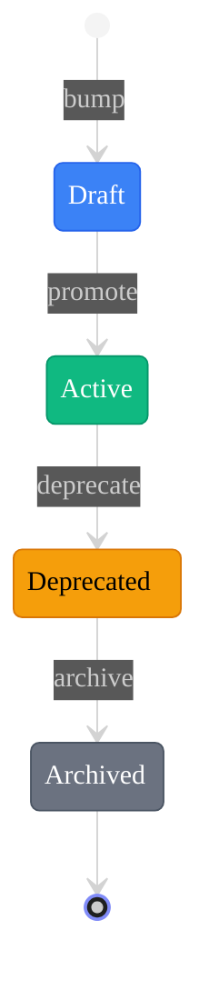

import { Step, Steps } from 'fumadocs-ui/components/steps';
import { Callout } from 'fumadocs-ui/components/callout';

## Overview

The `version` command manages version lifecycle for primitives, including creating new versions, promoting drafts, and deprecating old versions.

## Usage

```bash
agentic-p version <SUBCOMMAND> [OPTIONS]
```

## Subcommands

| Subcommand | Description |
|------------|-------------|
| `bump` | Create a new version |
| `list` | List all versions |
| `promote` | Promote draft to active |
| `deprecate` | Mark version as deprecated |
| `archive` | Archive old version |
| `set-default` | Set default version |

---

## version bump

Create a new version of a primitive.

```bash
agentic-p version bump <PATH> [OPTIONS]
```

### Options

| Option | Description | Default |
|--------|-------------|---------|
| `--notes <TEXT>` | Version notes (required) | - |
| `--version <N>` | Specific version number | Next sequential |
| `--copy-from <N>` | Copy content from version | Latest |

### Examples

```bash
# Create next version
agentic-p version bump python/python-pro --notes "Added async patterns"

# Create specific version
agentic-p version bump python/python-pro --version 3 --notes "Major rewrite"

# Copy from specific version
agentic-p version bump python/python-pro --copy-from 1 --notes "Fork from v1"
```

---

## version list

List all versions of a primitive.

```bash
agentic-p version list <PATH> [OPTIONS]
```

### Options

| Option | Description | Default |
|--------|-------------|---------|
| `--all` | Include archived versions | `false` |
| `--format <FMT>` | Output format: `table`, `json` | `table` |

### Examples

```bash
# List versions
agentic-p version list python/python-pro

# Include archived
agentic-p version list python/python-pro --all

# JSON output
agentic-p version list python/python-pro --format json
```

### Output

```
python/python-pro versions:

VERSION  STATUS      CREATED     NOTES
────────────────────────────────────────────────────
v1       deprecated  2025-11-13  Initial version
v2       active      2025-12-09  Added async patterns

Default: v2
```

---

## version promote

Promote a draft version to active status. This computes and locks the BLAKE3 hash.

```bash
agentic-p version promote <PATH> --version <N>
```

### Examples

```bash
# Promote version 2
agentic-p version promote python/python-pro --version 2
```

### Output

```
✓ Promoted python/python-pro v2 to active
  Hash: blake3:a7ffc6f8bf1ed76651c14756a061d662f580ff4de43b49fa82d80a4b80f8434a
```

<Callout type="warn">
Once promoted, a version's content cannot be modified. Create a new version for changes.
</Callout>

---

## version deprecate

Mark a version as deprecated. Users can still use it but will see warnings.

```bash
agentic-p version deprecate <PATH> --version <N>
```

### Examples

```bash
# Deprecate version 1
agentic-p version deprecate python/python-pro --version 1
```

### Output

```
✓ Deprecated python/python-pro v1
  Recommend: Update to v2
```

---

## version archive

Archive a version. It will be hidden from normal lists but preserved for history.

```bash
agentic-p version archive <PATH> --version <N>
```

### Examples

```bash
# Archive old version
agentic-p version archive python/python-pro --version 1
```

---

## version set-default

Change which version is used by default.

```bash
agentic-p version set-default <PATH> --version <N>
```

### Examples

```bash
# Set version 2 as default
agentic-p version set-default python/python-pro --version 2
```

### Output

```
✓ Set python/python-pro default version to v2
```

---

## Version Lifecycle



| State | Editable | Visible | Hash |
|-------|----------|---------|------|
| `draft` | ✅ Yes | ✅ Yes | `pending` |
| `active` | ❌ No | ✅ Yes | Computed |
| `deprecated` | ❌ No | ✅ Yes | Locked |
| `archived` | ❌ No | ❌ No | Locked |

## Complete Workflow

<Steps>
  <Step>
    ### Create new version
    ```bash
    agentic-p version bump python/python-pro --notes "Add error handling"
    ```
  </Step>
  <Step>
    ### Edit the content
    ```bash
    # Edit primitives/v1/agents/python/python-pro/python-pro.v3.md
    ```
  </Step>
  <Step>
    ### Validate
    ```bash
    agentic-p validate
    ```
  </Step>
  <Step>
    ### Promote when ready
    ```bash
    agentic-p version promote python/python-pro --version 3
    ```
  </Step>
  <Step>
    ### Set as default
    ```bash
    agentic-p version set-default python/python-pro --version 3
    ```
  </Step>
  <Step>
    ### Deprecate old version
    ```bash
    agentic-p version deprecate python/python-pro --version 2
    ```
  </Step>
</Steps>

## Related Commands

- [`agentic-p inspect`](/docs/cli/inspect) - View version details
- [`agentic-p validate`](/docs/cli/validate) - Validate versions
