import { Cards, Card } from 'fumadocs-ui/components/card';
import { Callout } from 'fumadocs-ui/components/callout';

## What are Primitives?

**Agentic primitives** are atomic, reusable building blocks for AI coding systems. They encapsulate:

- **Prompts** - Instructions that define agent behavior
- **Tools** - Integrations with external systems
- **Hooks** - Middleware for safety and observability
- **Metadata** - Version control, dependencies, and configuration

## The Five Primitive Types

<Cards>
  <Card title="🧠 Agents" href="/docs/guides/create-agent">
    Persistent personas with expertise, personality, and capabilities
  </Card>
  <Card title="⚡ Commands" href="/docs/guides/create-command">
    Task-focused prompts invoked with `/command-name`
  </Card>
  <Card title="📚 Skills" href="/docs/guides/create-skill">
    Reusable knowledge patterns referenced in prompts
  </Card>
  <Card title="🔧 Tools" href="/docs/guides/create-tool">
    Integrations with external systems and APIs
  </Card>
  <Card title="🪝 Hooks" href="/docs/guides/create-hook">
    Middleware for lifecycle events, safety, and analytics
  </Card>
</Cards>

## Primitive Lifecycle

```mermaid
%%{init: {'theme': 'dark', 'themeVariables': { 'primaryColor': '#6366F1', 'primaryTextColor': '#000', 'primaryBorderColor': '#4F46E5', 'lineColor': '#818CF8', 'fontFamily': 'system-ui, sans-serif'}}}%%
flowchart LR
    A["🆕 Create"]
    B["✅ Validate"]
    C["🔢 Version"]
    D["🔨 Build"]
    E["📥 Install"]
    F["🚀 Use"]

    A ==> B ==> C ==> D ==> E ==> F

    style A fill:#6366F1,stroke:#4F46E5,stroke-width:2px,color:#000
    style B fill:#7C3AED,stroke:#6D28D9,stroke-width:2px,color:#000
    style C fill:#8B5CF6,stroke:#7C3AED,stroke-width:2px,color:#000
    style D fill:#A78BFA,stroke:#8B5CF6,stroke-width:2px,color:#000
    style E fill:#C4B5FD,stroke:#A78BFA,stroke-width:2px,color:#000
    style F fill:#10B981,stroke:#059669,stroke-width:2px,color:#000
```

1. **Create** - Scaffold new primitive with `agentic-p new`
2. **Validate** - Check structure, schema, semantics with `agentic-p validate`
3. **Version** - Create new versions with `agentic-p version bump`
4. **Build** - Generate provider output with `agentic-p build`
5. **Install** - Deploy to project with `agentic-p install`
6. **Use** - Invoke in your AI workflows

## Next Steps

<Cards>
  <Card href="/docs/concepts/versioning" title="Versioning">
    Learn about immutable versioning with BLAKE3 hashes
  </Card>
  <Card href="/docs/concepts/providers" title="Providers">
    Understand provider-agnostic architecture
  </Card>
</Cards>
