import { Cards, Card } from 'fumadocs-ui/components/card';
import { Callout } from 'fumadocs-ui/components/callout';

## Provider-Agnostic Design

agentic-p primitives are **provider-agnostic at their core**. Write once, deploy anywhere.

```mermaid
%%{init: {'theme': 'dark', 'themeVariables': { 'primaryColor': '#6366F1', 'primaryTextColor': '#000', 'primaryBorderColor': '#4F46E5', 'lineColor': '#818CF8', 'fontFamily': 'system-ui, sans-serif'}}}%%
flowchart LR
    P["📦 Primitives"]
    B["🔨 Build"]
    C["Claude"]
    O["OpenAI"]
    Cu["Cursor"]
    L["LangGraph"]

    P ==> B
    B ==> C
    B ==> O
    B ==> Cu
    B ==> L

    style P fill:#6366F1,stroke:#4F46E5,stroke-width:2px,color:#000
    style B fill:#8B5CF6,stroke:#7C3AED,stroke-width:2px,color:#000
    style C fill:#F59E0B,stroke:#D97706,stroke-width:2px,color:#000
    style O fill:#10B981,stroke:#059669,stroke-width:2px,color:#000
    style Cu fill:#3B82F6,stroke:#2563EB,stroke-width:2px,color:#000
    style L fill:#EC4899,stroke:#DB2777,stroke-width:2px,color:#000
```



<Callout type="info">
Switch providers without rewriting your agents, commands, or hooks.
</Callout>

## Supported Providers

<Cards>
  <Card title="Claude" href="/docs/guides/deploy-claude">
    Anthropic's Claude with AGENTS.md and commands
  </Card>
  <Card title="OpenAI">
    GPT models with function calling (Coming Soon)
  </Card>
  <Card title="Cursor">
    IDE integration with .cursor rules (Coming Soon)
  </Card>
  <Card title="LangGraph">
    Multi-agent orchestration (Coming Soon)
  </Card>
</Cards>

## Building for Providers

```bash
# Build for Claude
agentic-p build --provider claude

# Build for all providers
agentic-p build --all
```
