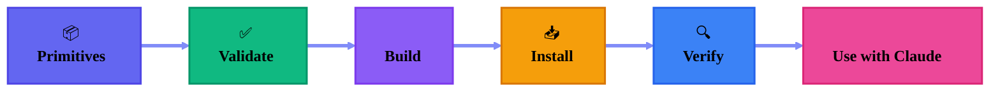

import { Accordions, Accordion } from 'fumadocs-ui/components/accordion';
import { Cards, Card } from 'fumadocs-ui/components/card';
import { Callout } from 'fumadocs-ui/components/callout';

## What You'll Learn

This guide walks you through deploying your agentic primitives to Claude Code, from building provider output to verifying your deployment.

<Callout type="info">
**Time:** ~10 minutes
**Prerequisites:** agentic-p installed, primitives created and validated
</Callout>

## Deployment Overview



## Step 1: Validate Your Primitives

Always validate before deploying:

```bash
# Full validation with hash checking
agentic-p validate --strict --check-hashes
```

Expected output:
```
✓ Validating primitives/v1/agents/python/python-pro
✓ Validating primitives/v1/hooks/security/bash-validator
✓ Validating primitives/v1/commands/qa/review

════════════════════════════════════════
✓ Validation passed: 3 primitives, 0 errors, 0 warnings
════════════════════════════════════════
```

<Callout type="warn">
Fix all errors and warnings before proceeding. Strict mode ensures your deployment will work correctly.
</Callout>

## Step 2: Build for Claude

Generate Claude-specific output:

```bash
agentic-p build --provider claude --clean
```

This creates:
```
build/claude/
├── .agentic-manifest.yaml      # Tracks installed primitives
├── hooks/
│   ├── hooks.json              # Hook configuration
│   └── security/
│       └── bash-validator.py   # Hook middleware
├── commands/
│   └── qa/
│       └── review.md           # Command prompt
└── agents/
    └── python/
        └── python-pro.md       # Agent prompt
```

### Preview the Build

```bash
# Preview without writing files
agentic-p build --provider claude --dry-run --verbose
```

## Step 3: Install to Your Project

### Project Installation (Recommended)

Install to the current project:

```bash
agentic-p install --provider claude --project
```

This copies files to `.claude/` in your project:
```
your-project/
├── .claude/
│   ├── .agentic-manifest.yaml
│   ├── hooks/
│   │   ├── hooks.json
│   │   └── security/
│   │       └── bash-validator.py
│   ├── commands/
│   │   └── qa/
│   │       └── review.md
│   └── agents/
│       └── python/
│           └── python-pro.md
├── src/
└── ...
```

### Global Installation

For primitives you want available in all projects:

```bash
agentic-p install --provider claude --global
```

Installs to `~/.claude/`.

### Preview Changes

```bash
# See what would change
agentic-p install --provider claude --project --dry-run --verbose
```

Output:
```
Dry run - No files will be changed

Target: .claude/

Changes:
  ADD     hooks/hooks.json
  ADD     hooks/security/bash-validator.py
  ADD     commands/qa/review.md
  ADD     agents/python/python-pro.md
  ADD     .agentic-manifest.yaml

Summary:
  5 file(s) would be added
  0 file(s) would be updated
```

## Step 4: Verify the Deployment

### Check File Structure

```bash
ls -la .claude/
```

### Verify Manifest

```bash
cat .claude/.agentic-manifest.yaml
```

```yaml
spec_version: "v1"
installed_at: "2025-12-09T10:30:00Z"
source: "/path/to/primitives"

primitives:
  - type: hook
    name: bash-validator
    version: 1
    hash: blake3:9f86d081884c7d659a2feaa0c55ad015a3bf4f1b2b0b822cd15d6c15b0f00a08
    path: hooks/security/bash-validator.py

  - type: command
    name: review
    version: 1
    hash: blake3:a7ffc6f8bf1ed76651c14756a061d662f580ff4de43b49fa82d80a4b80f8434a
    path: commands/qa/review.md

  - type: agent
    name: python-pro
    version: 2
    hash: blake3:def456...
    path: agents/python/python-pro.md
```

### Verify Hooks Configuration

```bash
cat .claude/hooks/hooks.json
```

```json
{
  "hooks": {
    "PreToolUse": [
      {
        "name": "bash-validator",
        "path": "./hooks/security/bash-validator.py",
        "matcher": {
          "tool_names": ["Bash", "Shell", "Execute"]
        }
      }
    ]
  }
}
```

## Step 5: Use with Claude

Your primitives are now live! Use them in Claude Code:

### Invoke an Agent

```
@python-pro Please review this async function for best practices:

async def fetch_all(urls):
    results = []
    for url in urls:
        results.append(await fetch(url))
    return results
```

### Run a Command

```
/review Check this authentication code for security issues:

def login(username, password):
    query = f"SELECT * FROM users WHERE name='{username}'"
    ...
```

### Hooks Work Automatically

Try a dangerous command to see the hook in action:
```
Please run: rm -rf /
```

The bash-validator hook will block this automatically!

## Updating Primitives

When you update your primitives:

```bash
# Make changes to primitives
# ...

# Validate
agentic-p validate

# Rebuild
agentic-p build --provider claude --clean

# Reinstall (smart update - only changed files)
agentic-p install --provider claude --project
```

## CI/CD Integration

### GitHub Actions

```yaml
# .github/workflows/deploy-primitives.yml
name: Deploy Primitives

on:
  push:
    branches: [main]
    paths:
      - 'primitives/**'

jobs:
  deploy:
    runs-on: ubuntu-latest
    steps:
      - uses: actions/checkout@v4

      - name: Setup Rust
        uses: actions-rs/toolchain@v1
        with:
          toolchain: stable

      - name: Build CLI
        run: |
          cd cli && cargo build --release
          echo "$PWD/target/release" >> $GITHUB_PATH

      - name: Validate
        run: agentic-p validate --strict --check-hashes

      - name: Build
        run: agentic-p build --provider claude --clean

      - name: Deploy
        run: |
          # Copy to deployment location
          cp -r build/claude/* $DEPLOYMENT_PATH/
```

## Troubleshooting

<Accordions>
  <Accordion title="Hooks not triggering">
    1. Verify `hooks.json` exists and is valid JSON
    2. Check hook paths are correct
    3. Ensure matcher patterns match the tool names Claude uses

    ```bash
    cat .claude/hooks/hooks.json | jq .
    ```
  </Accordion>

  <Accordion title="Agent not recognized">
    1. Verify the agent file is in the correct location
    2. Check the manifest includes the agent
    3. Restart Claude Code to pick up changes
  </Accordion>

  <Accordion title="Command not found">
    1. Verify the command file exists
    2. Check the command path matches the invocation
    3. Ensure the manifest is up to date
  </Accordion>

  <Accordion title="Hash mismatch on reinstall">
    The target file was modified locally. Options:
    - Use `--force` to overwrite
    - Investigate what changed
    - Create a new version if changes should be kept
  </Accordion>
</Accordions>

## Best Practices

<Cards>
  <Card title="Version Pin">
    Pin specific versions in production `agentic.yaml`
  </Card>
  <Card title="Test Before Deploy">
    Always validate and test hooks before deployment
  </Card>
  <Card title="Use Manifest">
    The manifest enables smart updates and rollbacks
  </Card>
  <Card title="Backup First">
    Backup `.claude/` before major updates
  </Card>
</Cards>

## Next Steps

<Cards>
  <Card
    title="CLI Reference"
    href="/docs/cli"
  >
    Explore all CLI commands
  </Card>
  <Card
    title="Versioning"
    href="/docs/concepts/versioning"
  >
    Learn about version management
  </Card>
</Cards>
