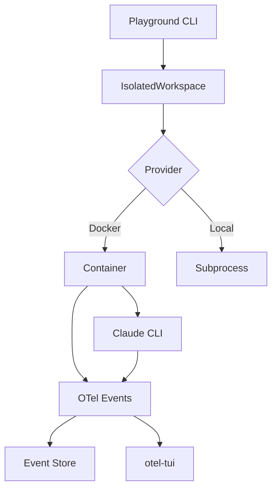

import { Cards, Card } from 'fumadocs-ui/components/card';
import { Callout } from 'fumadocs-ui/components/callout';

## What are Workspaces?

Workspaces are **isolated execution environments** for running AI agents safely. They provide:

- **Security Isolation** — Agents run in sandboxed Docker containers
- **Pre-configured Runtimes** — Claude CLI, Python, and tools pre-installed
- **OTel Observability** — Native OpenTelemetry support for real-time monitoring
- **Session Recording** — Capture agent sessions for deterministic testing

<Callout type="info">
Workspaces are the foundation for safe, observable, and reproducible agent execution.
</Callout>

## Architecture



## Provider Images

Workspace images are defined as primitives in `providers/workspaces/`:

| Image | Base | Runtime | OTel Support |
|-------|------|---------|--------------|
| `agentic-workspace-claude-cli` | node:22-slim | Claude CLI | ✅ Native |
| `base` | python:3.12-slim | Python only | ❌ Manual |

The Claude CLI image includes:
- Claude CLI (`@anthropic-ai/claude-code`)
- Python 3.12 with hooks support
- Security hardening (non-root user, setuid removed)
- Pre-installed primitives hooks

## Quick Start

### Using the Playground

The fastest way to run an agent in a workspace:

```bash
cd playground
uv run python run.py "Create a hello world script" --live
```

### Using Python API

For programmatic access:

```python
from agentic_isolation import IsolatedWorkspace, WorkspaceConfig

config = WorkspaceConfig(
    provider="docker",
    image="agentic-workspace-claude-cli:latest",
    timeout=300,
)

async with IsolatedWorkspace.create(config) as workspace:
    result = await workspace.execute(
        "claude -p 'List Python files' --output-format stream-json"
    )
    print(result.stdout)
```

## Docker vs Local Execution

| Feature | Docker | Local |
|---------|--------|-------|
| **Isolation** | ✅ Full container | ❌ None |
| **Security** | ✅ Non-root, sandboxed | ⚠️ User permissions |
| **OTel** | ✅ Built-in | ⚠️ Manual setup |
| **Speed** | ~2s startup | Instant |
| **Resource Limits** | ✅ CPU/Memory | ❌ None |
| **Reproducibility** | ✅ Consistent | ⚠️ Environment varies |

**Recommendation**: Use Docker for production and CI/CD. Use local for rapid development.

## Recording Sessions

Record agent sessions for deterministic testing:

```bash
# Using docker-compose sidecar
PROMPT="List files" TASK="list-files" docker compose -f docker-compose.record.yaml up
```

Recordings enable:
- **No API costs** in tests (record once, replay forever)
- **Deterministic** test execution
- **Fast** replay (1000x speed)
- **CI/CD friendly** (no secrets needed)

See [Session Recording](./recording) for details.

## Next Steps

<Cards>
  <Card
    title="Playground"
    href="/docs/guides/workspaces/playground"
  >
    Interactive execution with live OTel events
  </Card>
  <Card
    title="Docker Isolation"
    href="/docs/guides/workspaces/docker"
  >
    Container security and configuration
  </Card>
  <Card
    title="Session Recording"
    href="/docs/guides/workspaces/recording"
  >
    Capture sessions for testing
  </Card>
  <Card
    title="Scenarios"
    href="/docs/guides/workspaces/scenarios"
  >
    Configure agent execution with YAML
  </Card>
</Cards>

## Related

- [ADR-027: Provider-Based Workspace Images](/docs/adrs/027-provider-workspace-images)
- [ADR-030: Session Recording for Testing](/docs/adrs/030-session-recording-testing)
