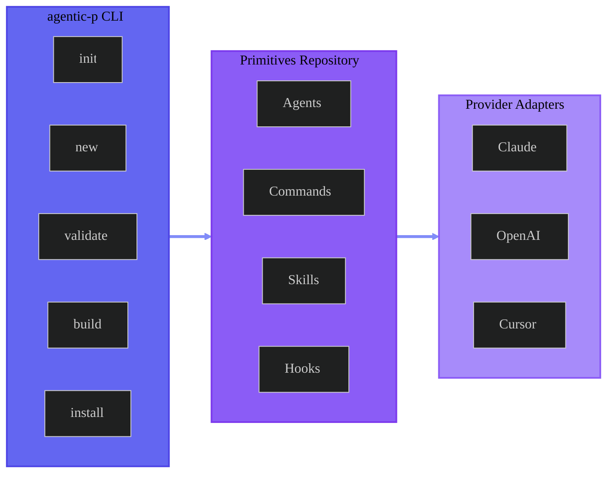

import { Cards, Card } from 'fumadocs-ui/components/card';
import { Accordions, Accordion } from 'fumadocs-ui/components/accordion';

<HeroScene />

  <Badge variant="indigo" icon="bot">AI-Native</Badge>
  <Badge variant="purple" icon="package">Version Controlled</Badge>
  <Badge variant="pink" icon="plug">Provider Agnostic</Badge>
  <Badge variant="cyan" icon="zap">Open Source</Badge>

## What is agentic-primitives?

**agentic-primitives** is a CLI tool and framework for managing **agentic primitives** — atomic, reusable components that define how AI agents think, act, and integrate into your workflows.

Think of it as a **standard library for AI agents**: prompts, tools, and hooks that you can compose, version, and deploy across different LLM providers like Claude, OpenAI, and more.

<ButtonGroup>
  <GradientButton href="/docs/quickstart" variant="bright" icon="rocket">
    Get Started
  </GradientButton>
  <GradientButton href="/docs/cli" variant="outline" icon="terminal">
    CLI Reference
  </GradientButton>
</ButtonGroup>

## Primitive Types

Agentic primitives come in five composable types:

<PrimitiveGrid>
  <PrimitiveCard
    icon="agent"
    name="Agent"
    description="Persistent persona with expertise and specialized knowledge"
    invocation="@agent-name"
    color="indigo"
  />
  <PrimitiveCard
    icon="command"
    name="Command"
    description="Performs a specific task on demand"
    invocation="/command-name"
    color="purple"
  />
  <PrimitiveCard
    icon="skill"
    name="Skill"
    description="Reusable knowledge patterns and techniques"
    invocation="Referenced in prompts"
    color="pink"
  />
  <PrimitiveCard
    icon="tool"
    name="Tool"
    description="Integrates external systems and APIs"
    invocation="Available to agents"
    color="cyan"
  />
  <PrimitiveCard
    icon="hook"
    name="Hook"
    description="Handles lifecycle events and middleware"
    invocation="Automatic"
    color="green"
  />
</PrimitiveGrid>

## Why Agentic Primitives?

Modern AI development faces several challenges:

<Accordions>
  <Accordion title="Reusability">
    Most AI prompts and configurations are copy-pasted between projects with no version control or standardization. Primitives provide a single source of truth.
  </Accordion>
  <Accordion title="Provider Lock-in">
    Switching between Claude, OpenAI, or other providers requires rewriting prompts and tools. Primitives are provider-agnostic at their core.
  </Accordion>
  <Accordion title="Safety & Control">
    AI agents need guardrails. The hook system provides composable middleware for safety, observability, and policy enforcement.
  </Accordion>
  <Accordion title="Versioning">
    Prompts evolve but there's no good way to track changes. Primitives use immutable versioning with BLAKE3 hashes.
  </Accordion>
</Accordions>

## Key Features

<FeatureGrid>
  <FeatureCard
    icon="lock"
    title="Version Control"
    description="Immutable versions with BLAKE3 hashes for integrity verification"
    gradient="purple"
  />
  <FeatureCard
    icon="plug"
    title="Provider Agnostic"
    description="Write once, deploy to Claude, OpenAI, Cursor, and more"
    gradient="indigo"
  />
  <FeatureCard
    icon="check"
    title="Strict Validation"
    description="Three-layer validation: structural, schema, and semantic"
    gradient="cyan"
  />
  <FeatureCard
    icon="puzzle"
    title="Composable"
    description="Mix and match primitives to build complex behaviors"
    gradient="pink"
  />
</FeatureGrid>

## Architecture Overview

## Next Steps

<ButtonGroup className="mb-4">
  <GradientButton href="/docs/quickstart" variant="bright" icon="rocket">
    Quick Start
  </GradientButton>
  <GradientButton href="https://github.com/AgentParadise/agentic-primitives" variant="outline" icon="book">
    View on GitHub
  </GradientButton>
</ButtonGroup>

<Cards>
  <Card href="/docs/quickstart" title="Quick Start">
    Create your first primitive in 5 minutes
  </Card>
  <Card href="/docs/installation" title="Installation">
    Detailed installation instructions
  </Card>
  <Card href="/docs/concepts/primitives" title="Core Concepts">
    Understand primitives, versioning, and providers
  </Card>
  <Card href="/docs/guides/create-agent" title="Guides">
    Step-by-step tutorials for every primitive type
  </Card>
</Cards>
