import { Accordions, Accordion } from 'fumadocs-ui/components/accordion';
import { Step, Steps } from 'fumadocs-ui/components/steps';
import { Callout } from 'fumadocs-ui/components/callout';

## Overview

All architecture and flow diagrams should use [Mermaid](https://mermaid.js.org/) syntax. This ensures consistency, version control, and automatic rendering.

<Callout type="info">
Fumadocs has native Mermaid support via the `@theguild/remark-mermaid` plugin. Just use fenced code blocks with the `mermaid` language identifier.
</Callout>

## Standard Theme Configuration

**Always start diagrams with this theme init block:**

```text
%%{init: {'theme': 'dark', 'themeVariables': {
  'primaryColor': '#6366F1',
  'primaryTextColor': '#000',
  'primaryBorderColor': '#4F46E5',
  'lineColor': '#818CF8',
  'fontFamily': 'system-ui, sans-serif'
}}}%%
```

This ensures diagrams match our brand colors and look great in dark mode.

---

## Brand Color Palette

<Accordions>
  <Accordion title="Primary Colors (Indigo/Purple)">
    Use these for main flow elements:

    | Color | Fill | Stroke | Text |
    |-------|------|--------|------|
    | Primary Indigo | `#6366F1` | `#4F46E5` | `#000` |
    | Purple | `#8B5CF6` | `#7C3AED` | `#000` |
    | Light Purple | `#A78BFA` | `#8B5CF6` | `#000` |
    | Lavender | `#C4B5FD` | `#A78BFA` | `#000` |

    ```text
    style A fill:#6366F1,stroke:#4F46E5,stroke-width:2px,color:#000
    ```
  </Accordion>

  <Accordion title="Status Colors">
    Use these for semantic meaning:

    | Status | Fill | Stroke | Text |
    |--------|------|--------|------|
    | Success | `#10B981` | `#059669` | `#000` |
    | Warning | `#F59E0B` | `#D97706` | `#000` |
    | Info | `#3B82F6` | `#2563EB` | `#000` |
    | Error | `#EF4444` | `#DC2626` | `#fff` |
    | Neutral | `#6B7280` | `#4B5563` | `#fff` |

    ```text
    style Success fill:#10B981,stroke:#059669,stroke-width:2px,color:#000
    ```
  </Accordion>

  <Accordion title="Accent Colors">
    Use for variety in multi-node diagrams:

    | Accent | Fill | Stroke | Text |
    |--------|------|--------|------|
    | Pink | `#EC4899` | `#DB2777` | `#000` |
    | Cyan | `#06B6D4` | `#0891B2` | `#000` |
    | Orange | `#F97316` | `#EA580C` | `#000` |

    ```text
    style Accent fill:#EC4899,stroke:#DB2777,stroke-width:2px,color:#000
    ```
  </Accordion>
</Accordions>

<Callout type="warn">
**Always use black text (`color:#000`) on light fills.** Only use white text (`color:#fff`) on dark fills like Error red or Neutral gray.
</Callout>

---

## Flowchart Guidelines

### Use Horizontal Layout for Width

```mermaid
%%{init: {'theme': 'dark', 'themeVariables': { 'primaryColor': '#6366F1', 'primaryTextColor': '#000', 'primaryBorderColor': '#4F46E5', 'lineColor': '#818CF8', 'fontFamily': 'system-ui, sans-serif'}}}%%
flowchart LR
    A["🆕<br/><b>Create</b>"]
    B["✅<br/><b>Validate</b>"]
    C["🚀<br/><b>Deploy</b>"]

    A ==> B ==> C

    style A fill:#6366F1,stroke:#4F46E5,stroke-width:2px,color:#000
    style B fill:#8B5CF6,stroke:#7C3AED,stroke-width:2px,color:#000
    style C fill:#10B981,stroke:#059669,stroke-width:2px,color:#000
```



**Source:**

````text

````

### Node Label Best Practices

<Steps>
  <Step>
    ### Use Emojis for Visual Interest
    ```text
    A["🚀<br/><b>Deploy</b>"]
    ```
  </Step>
  <Step>
    ### Add Line Breaks with &lt;br/&gt;
    ```text
    A["🧠<br/><b>Agent</b><br/>Persona"]
    ```
  </Step>
  <Step>
    ### Bold Important Text
    ```text
    A["<b>Primary Label</b><br/>Secondary text"]
    ```
  </Step>
</Steps>

### Arrow Types

| Arrow | Syntax | Use Case |
|-------|--------|----------|
| Thick | `==>` | Main flow, primary connections |
| Normal | `-->` | Secondary connections |
| Dotted | `-.->` | Optional or async flows |

---

## State Diagrams

For lifecycle or state machine diagrams:


---

## Subgraphs for Grouping

```mermaid
%%{init: {'theme': 'dark', 'themeVariables': { 'primaryColor': '#6366F1', 'primaryTextColor': '#000', 'primaryBorderColor': '#4F46E5', 'lineColor': '#818CF8', 'fontFamily': 'system-ui, sans-serif'}}}%%
flowchart LR
    subgraph Input["📥 Input"]
        direction LR
        A["Source A"]
        B["Source B"]
    end

    subgraph Process["⚙️ Process"]
        direction LR
        C["Transform"]
    end

    subgraph Output["📤 Output"]
        direction LR
        D["Result"]
    end

    A --> C
    B --> C
    C --> D

    style Input fill:#6366F1,stroke:#4F46E5,stroke-width:2px,color:#000
    style Process fill:#8B5CF6,stroke:#7C3AED,stroke-width:2px,color:#000
    style Output fill:#10B981,stroke:#059669,stroke-width:2px,color:#000
```



---

## Checklist

Before committing diagrams, verify:

- [ ] Theme init block is present
- [ ] Using `flowchart LR` for horizontal layout
- [ ] All nodes have explicit styles
- [ ] Text color is readable (`#000` on light, `#fff` on dark)
- [ ] `stroke-width:2px` is set for visibility
- [ ] Emojis and `<b>` tags for visual hierarchy
- [ ] Using `==>` for main flow arrows
