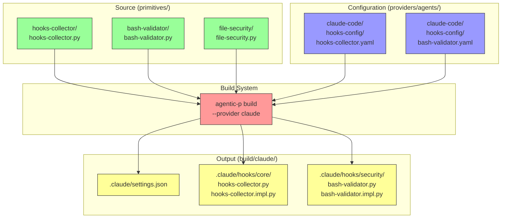
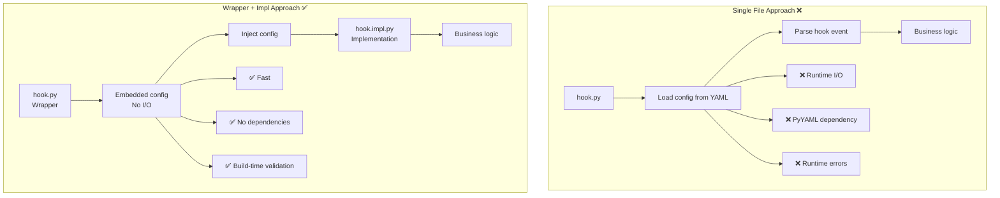
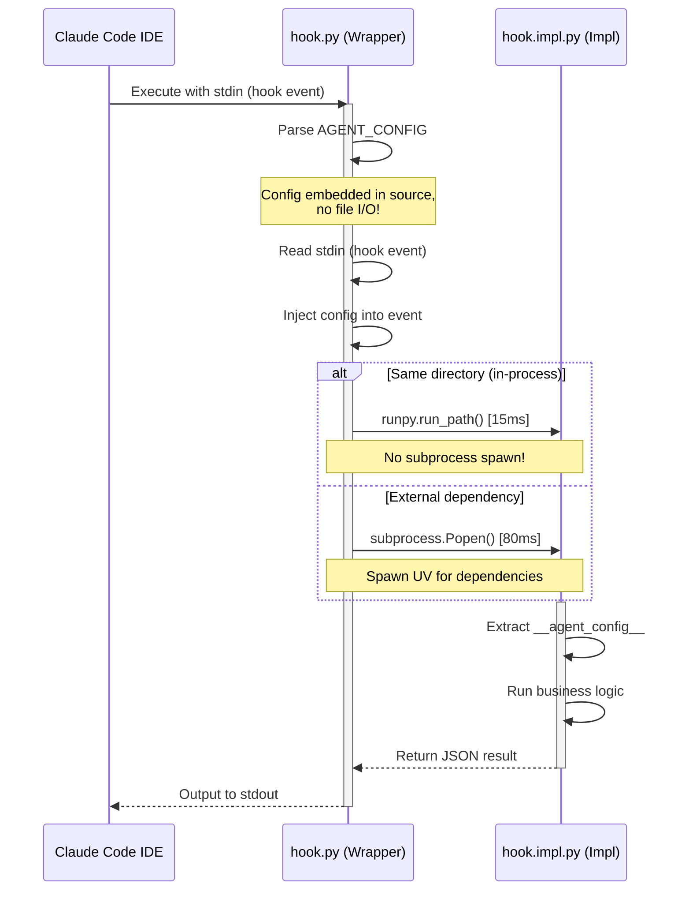

# Build Output Structure

This document explains the structure of the `build/` directory and the purpose of each generated file.

## Overview



## Directory Structure

```
build/
└── claude/                          # Provider-specific output
    ├── .claude/
    │   ├── settings.json           # Claude Code hook registration
    │   └── hooks/                  # Hook implementations
    │       ├── core/               # Core/observability hooks
    │       │   ├── hooks-collector.py      # Wrapper (generated)
    │       │   └── hooks-collector.impl.py # Implementation (copied)
    │       ├── security/           # Security hooks
    │       │   ├── bash-validator.py
    │       │   ├── bash-validator.impl.py
    │       │   ├── file-security.py
    │       │   ├── file-security.impl.py
    │       │   ├── prompt-filter.py
    │       │   └── prompt-filter.impl.py
    │       └── test/               # Test hooks
    │           ├── test-all-events.py
    │           └── test-all-events.impl.py
    └── mcp.json                    # MCP server configurations
```

## File Types

### 1. `settings.json` - Hook Registration

**Purpose:** Register hooks with Claude Code IDE  
**Generated:** Yes (merged during build)  
**Format:** JSON

```json
{
  "hooks": {
    "PreToolUse": [
      {
        "matcher": "bash",
        "hooks": [
          {
            "type": "command",
            "command": "${CLAUDE_PROJECT_DIR}/.claude/hooks/security/bash-validator.py",
            "timeout": 5
          }
        ]
      }
    ],
    "UserPromptSubmit": [
      {
        "matcher": "*",
        "hooks": [
          {
            "type": "command",
            "command": "${CLAUDE_PROJECT_DIR}/.claude/hooks/security/prompt-filter.py",
            "timeout": 3
          }
        ]
      }
    ]
  }
}
```

**Key Fields:**
- `hooks[event]` - Array of hook entries for each event type
- `matcher` - Filter by tool name (e.g., `bash`, `*` for all)
- `command` - Path to wrapper script
- `timeout` - Execution timeout in seconds

### 2. Wrapper Files (`.py`) - Generated

**Purpose:** Inject agent-specific configuration and execute implementation  
**Generated:** Yes (from template)  
**Location:** `build/claude/.claude/hooks/{category}/{hook-id}.py`

```mermaid
graph LR
    A[Template<br/>hook_wrapper_with_config.py.template] --> B[Build System]
    C[Agent Config<br/>providers/agents/claude-code/hooks-config/] --> B
    B --> D[Generated Wrapper<br/>{hook-id}.py]
    
    style A fill:#9cf,stroke:#333
    style C fill:#99f,stroke:#333
    style D fill:#ff9,stroke:#333
```

**Structure:**
```python
#!/usr/bin/env python3
"""Generated hook wrapper for {hook-id}"""

# Embedded agent-specific configuration
AGENT_CONFIG = r'''{
  "agent": "claude-code",
  "hook_id": "bash-validator",
  "primitive": {...},
  "execution": {"timeout_sec": 5, "fail_on_error": true}
}'''

def main():
    # 1. Parse embedded config
    config_data = json.loads(AGENT_CONFIG)
    
    # 2. Read hook event from stdin
    hook_event = json.loads(sys.stdin.read())
    
    # 3. Inject config into event
    hook_event['__agent_config__'] = config_data
    
    # 4. Execute implementation
    if impl_in_same_dir:
        # In-process execution (fast!)
        sys.stdin = io.StringIO(json.dumps(hook_event))
        runpy.run_path("bash-validator.impl.py")
    else:
        # External dependency (spawn subprocess)
        subprocess.Popen(["uv", "run", "python3", impl_file])
```

**Why Generated?**
- ✅ Embeds agent config at build time (no runtime I/O)
- ✅ Each agent can customize the same primitive
- ✅ Configuration errors caught during build
- ✅ No PyYAML dependency at runtime

### 3. Implementation Files (`.impl.py`) - Copied

**Purpose:** Pure Python business logic  
**Generated:** No (copied from primitives/)  
**Location:** `build/claude/.claude/hooks/{category}/{hook-id}.impl.py`

```mermaid
graph LR
    A[Source<br/>primitives/v1/hooks/{category}/{hook-id}/{hook-id}.py] --> B[Build System]
    B --> C[Copied Implementation<br/>build/claude/.claude/hooks/{category}/{hook-id}.impl.py]
    
    style A fill:#9f9,stroke:#333
    style C fill:#ff9,stroke:#333
```

**Structure:**
```python
#!/usr/bin/env python3
"""Generic hook implementation (works for any agent)"""

def main():
    # 1. Read event from stdin (includes injected __agent_config__)
    hook_event = json.loads(sys.stdin.read())
    
    # 2. Extract agent config (optional)
    agent_config = hook_event.pop('__agent_config__', None)
    
    # 3. Business logic
    if is_dangerous(hook_event):
        result = {"decision": "block", "reason": "Dangerous operation"}
    else:
        result = {"decision": "allow"}
    
    # 4. Return result to stdout
    print(json.dumps(result))
```

**Why Copied?**
- ✅ Generic - works with any agent provider
- ✅ Testable - can be tested independently
- ✅ Version controlled - changes tracked in primitives/
- ✅ Reusable - same impl for Claude, OpenAI, Gemini

## Wrapper + Impl Pattern

### Why Two Files?



### Execution Flow



### Performance Comparison

| Approach | Files | Config Loading | Execution | Latency |
|----------|-------|----------------|-----------|---------|
| **Single file + YAML** | 1 | Runtime (file I/O) | Subprocess | 150ms |
| **Single file + ENV** | 1 | Runtime (parse ENV) | Subprocess | 100ms |
| **Wrapper + Impl** | 2 | Build-time (embedded) | In-process | **15ms** |

## File Naming Convention

### Pattern

```
{hook-id}.py         # Wrapper (generated)
{hook-id}.impl.py    # Implementation (copied)
```

### Examples

```
hooks-collector.py / hooks-collector.impl.py
bash-validator.py / bash-validator.impl.py
file-security.py / file-security.impl.py
prompt-filter.py / prompt-filter.impl.py
```

### Why `.impl.py`?

1. **Clear Distinction** - Easy to identify generated vs source files
2. **Prevents Confusion** - Can't accidentally execute impl directly
3. **Better Debugging** - Stack traces show `{hook}.impl.py:42`
4. **Tooling Support** - Can filter/process impl files separately

## Build Process

```mermaid
flowchart TD
    Start[cargo run -- build --provider claude] --> Scan[Scan primitives/v1/hooks/]
    
    Scan --> Load[Load hook metadata]
    Load --> Config{Has agent config?}
    
    Config -->|Yes| AgentConfig[Load providers/agents/claude-code/hooks-config/{hook-id}.yaml]
    Config -->|No| DefaultConfig[Use primitive defaults]
    
    AgentConfig --> GenWrapper[Generate wrapper from template]
    DefaultConfig --> GenWrapper
    
    GenWrapper --> Embed[Embed config as AGENT_CONFIG string]
    Embed --> Write[Write {hook-id}.py]
    
    Write --> CopyImpl[Copy {hook-id}.py to {hook-id}.impl.py]
    
    CopyImpl --> Register[Register in settings.json]
    Register --> Done[Build complete]
    
    style Start fill:#f99,stroke:#333
    style GenWrapper fill:#9cf,stroke:#333
    style Embed fill:#99f,stroke:#333
    style Write fill:#ff9,stroke:#333
    style CopyImpl fill:#ff9,stroke:#333
    style Register fill:#9f9,stroke:#333
    style Done fill:#9f9,stroke:#333
```

## Installation

To install hooks in a project:

```bash
# Option 1: Copy entire build output
cp -r build/claude/.claude ~/my-project/

# Option 2: Symlink for development
ln -s $(pwd)/build/claude/.claude ~/my-project/.claude

# Option 3: Use agentic-p install (future)
agentic-p install --provider claude --target ~/my-project
```

Claude Code will automatically:
1. Read `.claude/settings.json`
2. Register hooks for each event type
3. Execute hooks when events occur

## Verification

### Check Build Output

```bash
# Verify structure
tree build/claude/.claude/

# Verify settings.json
cat build/claude/.claude/settings.json | jq '.hooks'

# Verify wrapper has embedded config
grep "AGENT_CONFIG" build/claude/.claude/hooks/core/hooks-collector.py

# Verify impl exists
ls -la build/claude/.claude/hooks/core/*.impl.py
```

### Test Hook Execution

```bash
# Test wrapper directly
echo '{"hook_event_name":"PreToolUse","tool_name":"Bash","tool_input":{"command":"ls"}}' | \
  build/claude/.claude/hooks/security/bash-validator.py

# Expected output:
# {"decision":"allow"}
```

## Troubleshooting

### Missing `.impl.py` file

**Symptom:** `FileNotFoundError: hook.impl.py`

**Cause:** Build didn't copy implementation file

**Fix:**
```bash
# Rebuild
cargo run --manifest-path cli/Cargo.toml -- build --provider claude

# Verify impl file exists
ls build/claude/.claude/hooks/*/
```

### Infinite recursion

**Symptom:** Stack overflow, `RecursionError`

**Cause:** Wrapper trying to execute itself instead of impl

**Fix:** Check agent config has correct `impl_file`:
```yaml
# providers/agents/claude-code/hooks-config/hook.yaml
primitive:
  impl_file: "hook-id.impl.py"  # Must have .impl.py suffix!
```

### Slow execution

**Symptom:** Hooks taking >100ms

**Cause:** Wrapper spawning subprocesses instead of in-process execution

**Fix:** Verify impl is in same directory as wrapper:
```bash
# Both should be in same directory
ls build/claude/.claude/hooks/security/
# bash-validator.py
# bash-validator.impl.py
```

## Related Documentation

- [ADR-014: Wrapper+Impl Pattern](../adrs/014-wrapper-impl-pattern.md)
- [ADR-013: Hybrid Hook Architecture](../adrs/013-hybrid-hook-architecture.md)
- [Hook Development Guide](./hook-development.md)
- [Build System Reference](../../cli/src/providers/claude.rs)

