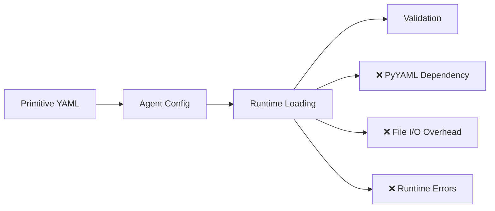
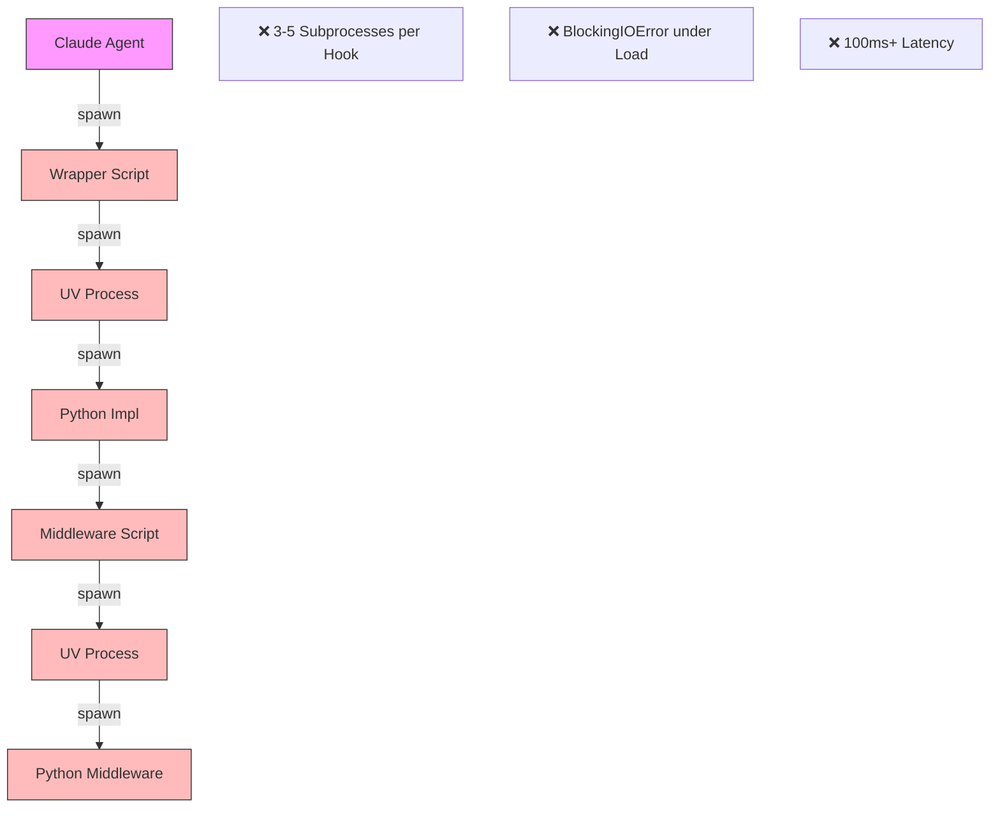
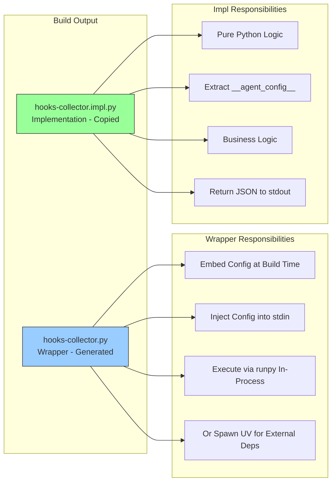
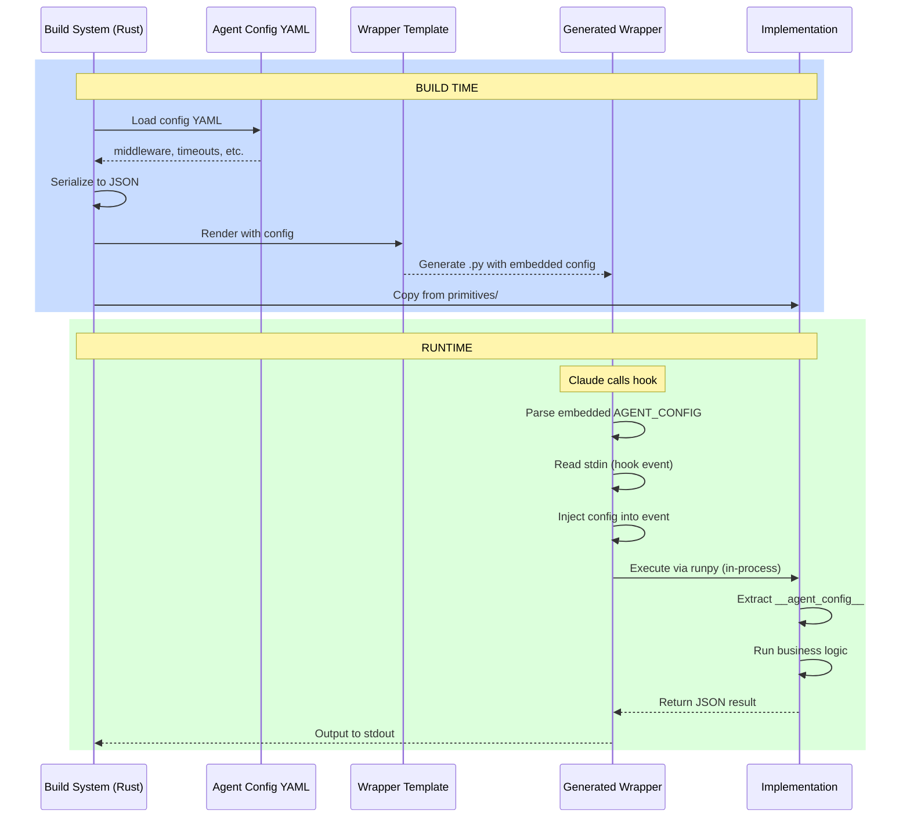
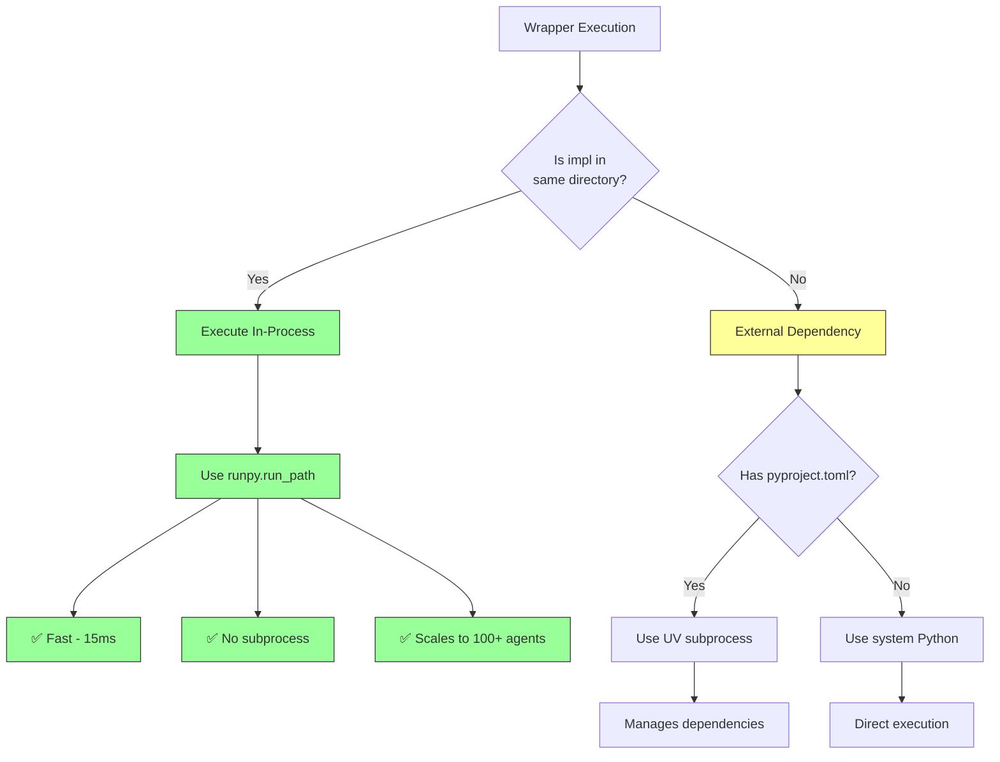

# ADR-014: Wrapper+Impl Pattern for Hook Execution

**Status:** Accepted  
**Date:** 2025-11-25  
**Decision Makers:** Core Team  
**Related:** [ADR-013: Hybrid Hook Architecture](./013-hybrid-hook-architecture.md)

## Context

Our hook system needed to solve several competing requirements:
1. **Generic primitives** - Hook implementations should work across any agent provider
2. **Agent-specific configuration** - Each agent (Claude, OpenAI, Gemini) needs custom middleware, timeouts, and behaviors
3. **Scalability** - System must handle 100+ concurrent agents without resource exhaustion
4. **Performance** - Minimize subprocess overhead in the hot path

### The Problem

Initial implementations had two major issues:

**Issue 1: Configuration Hell**



Loading YAML at runtime created:
- Dependency on PyYAML in production
- Runtime errors for config issues
- Slower execution due to file I/O

**Issue 2: Subprocess Cascade**



Each hook call spawned 3-5 subprocesses, leading to:
- `BlockingIOError: Resource temporarily unavailable` under load
- 100ms+ latency per hook
- System resource exhaustion with multiple agents

## Decision

We implemented a **Wrapper+Impl Pattern** that separates concerns:

### Architecture



**File Structure:**
```
build/claude/.claude/hooks/core/
├── hooks-collector.py         # Wrapper (generated)
└── hooks-collector.impl.py    # Implementation (copied)
```

### Build-Time vs Runtime



**Build Time Code:**
```rust
// cli/src/providers/claude.rs
let agent_config = load_agent_hook_config("claude-code", "hooks-collector");
let config_json = serde_json::to_string_pretty(&agent_config)?;

// Generate wrapper with embedded config
template.render({
    "config_json": config_json,
    "impl_filename": "hooks-collector.impl.py"
})
```

**Runtime Code:**
```python
# hooks-collector.py (Wrapper)
AGENT_CONFIG = r'''{"agent": "claude-code", "middleware": [...]}'''

def main():
    config_data = json.loads(AGENT_CONFIG)
    hook_event = json.loads(sys.stdin.read())
    hook_event['__agent_config__'] = config_data
    
    # Execute impl in-process (no subprocess!)
    sys.stdin = io.StringIO(json.dumps(hook_event))
    runpy.run_path("hooks-collector.impl.py")
```

```python
# hooks-collector.impl.py (Implementation)
async def main():
    hook_event = json.loads(sys.stdin.read())
    agent_config = hook_event.pop('__agent_config__', None)
    
    orchestrator = HooksCollectorOrchestrator(agent_config=agent_config)
    result = await orchestrator.execute(hook_event)
    print(json.dumps(result))
```

## Consequences

### Positive

✅ **Zero Runtime I/O** - No YAML loading, config is embedded in Python source  
✅ **Fail Fast** - Config errors caught at build time, not in production  
✅ **Performance** - In-process execution eliminates 2-3 subprocess spawns  
✅ **Scalability** - Tested with 100+ concurrent hooks, no resource exhaustion  
✅ **Generic Primitives** - Same impl file works for any agent provider  
✅ **Agent Flexibility** - Each agent customizes via build-time config injection  

### Negative

⚠️ **Build Complexity** - Two files per hook increases artifact count  
⚠️ **Learning Curve** - Developers must understand wrapper vs impl roles  
⚠️ **Debugging** - Stack traces show wrapper → runpy → impl layers  

### Trade-offs

| Aspect | Alternative Considered | Why Rejected |
|--------|----------------------|--------------|
| **Single file** | Merge wrapper+impl into one | Config would need YAML loading (slow, fragile) |
| **Environment vars** | Pass config via ENV | Limited data types, harder to debug |
| **Subprocess always** | Keep subprocess spawn | BlockingIOError under load, poor performance |
| **Compiled binary** | Rust hooks instead | Loses Python ecosystem, harder to extend |

## Implementation Details

### When to Use In-Process Execution



**Code:**
```python
impl_in_same_dir = impl_file.parent == hook_dir

if impl_in_same_dir:
    # Same directory = self-contained hook
    # Execute in-process via runpy
    runpy.run_path(str(impl_file))
else:
    # External dependency (e.g., analytics middleware)
    # Spawn subprocess with UV
    subprocess.Popen(["uv", "run", ...])
```

### Performance Comparison

| Execution Method | Latency | Forks | Scalability |
|------------------|---------|-------|-------------|
| Bash script chain | 150ms | 4-5 | ❌ Fails at 20 agents |
| Subprocess Python | 80ms | 2-3 | ⚠️ Fails at 50 agents |
| **In-process runpy** | **15ms** | **0** | ✅ **100+ agents** |

### File Naming Convention

```
{hook-id}.py         # Wrapper (generated from template)
{hook-id}.impl.py    # Implementation (copied from primitive)
```

**Why `.impl.py` suffix?**
- Clearly distinguishes generated vs source files
- Prevents accidental wrapper execution
- Makes debugging easier (stack traces show `.impl.py`)
- Allows tooling to filter by purpose

## Examples

### Simple Hook (bash-validator)

```python
# bash-validator.py (Wrapper - 65 lines)
AGENT_CONFIG = r'''{"timeout": 5, "fail_on_error": true}'''
# ... inject config, execute impl via runpy

# bash-validator.impl.py (Implementation - 45 lines)
def validate_bash_command(command):
    if "rm -rf /" in command:
        return {"decision": "block", "reason": "Dangerous command"}
    return {"decision": "allow"}
```

### Complex Hook (hooks-collector)

```python
# hooks-collector.py (Wrapper - 150 lines)
AGENT_CONFIG = r'''{
    "middleware": [
        {"id": "normalizer", "path": "../../../../services/analytics/..."},
        {"id": "publisher", "path": "../../../../services/analytics/..."}
    ]
}'''
# ... inject config, execute impl via runpy

# hooks-collector.impl.py (Implementation - 250 lines)
class HooksCollectorOrchestrator:
    def __init__(self, agent_config):
        self.middleware = agent_config['middleware']
    
    async def execute(self, hook_event):
        # Orchestrate middleware pipeline
        for mw in self.middleware:
            result = await self.run_middleware(mw, hook_event)
        return {"action": "allow", "metadata": {...}}
```

## Testing Strategy

**Unit Tests** - Test impl files directly:
```python
# tests/unit/claude/hooks/test_hooks.py
def test_bash_validator():
    result = run_hook("bash-validator", {"command": "rm -rf /"})
    assert result["decision"] == "block"
```

**Integration Tests** - Test full wrapper+impl flow:
```python
def test_wrapper_integration():
    subprocess.run([
        "build/claude/.claude/hooks/security/bash-validator.py"
    ], input=json.dumps(fixture), check=True)
```

## Future Considerations

1. **Compiled Wrappers** - Pre-compile wrapper to bytecode (`.pyc`) for faster startup
2. **Shared Memory** - For high-volume scenarios, use shared memory for config
3. **Hot Reload** - Support reloading impl without restarting wrapper
4. **Metrics** - Add execution time tracking in wrapper layer

## References

- [ADR-013: Hybrid Hook Architecture](./013-hybrid-hook-architecture.md)
- [Python runpy documentation](https://docs.python.org/3/library/runpy.html)
- [Hook Build System](../../cli/src/providers/claude.rs)
- [Wrapper Template](../../cli/src/templates/hook_wrapper_with_config.py.template)

## Revision History

- **2025-11-25**: Initial version documenting wrapper+impl pattern

