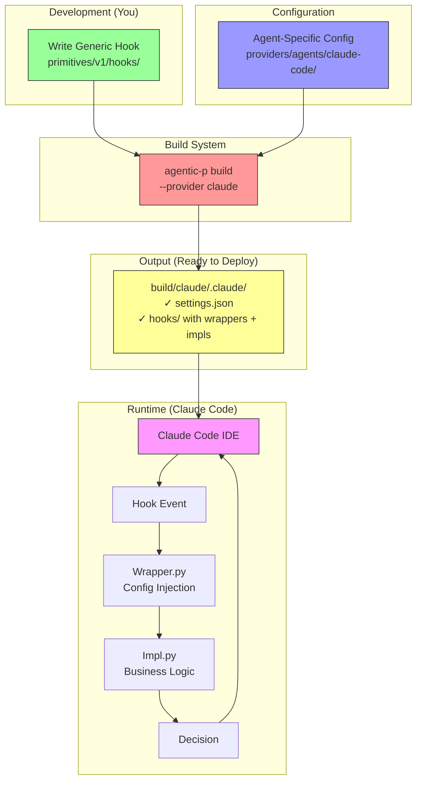
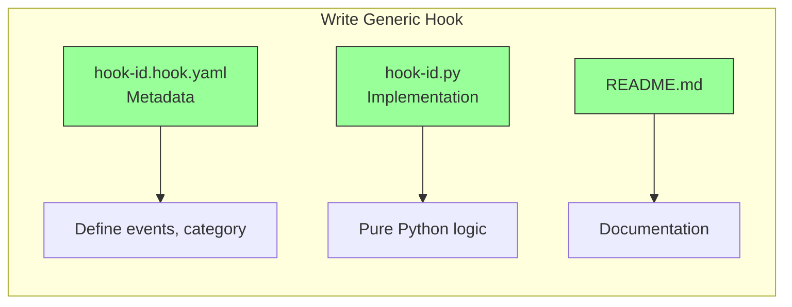
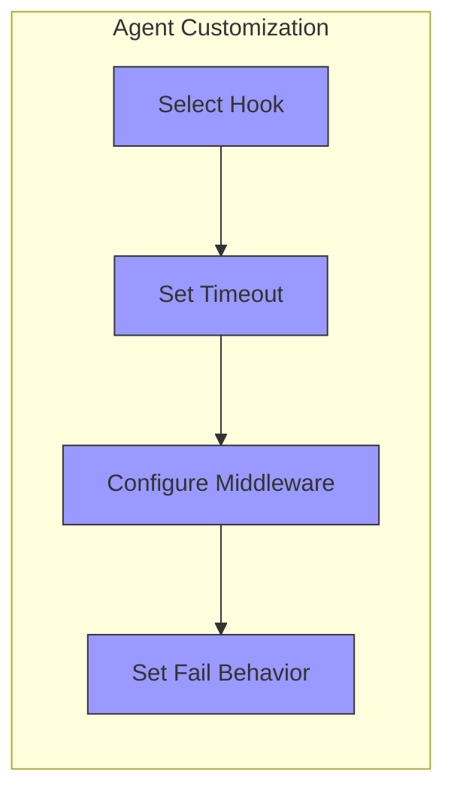
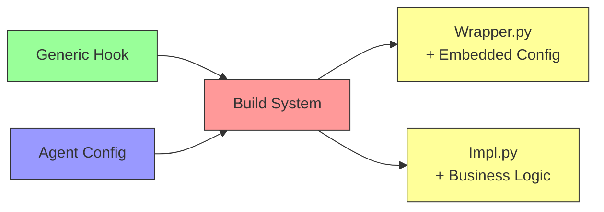
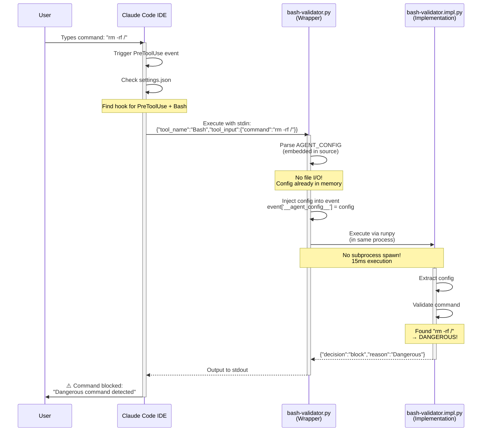
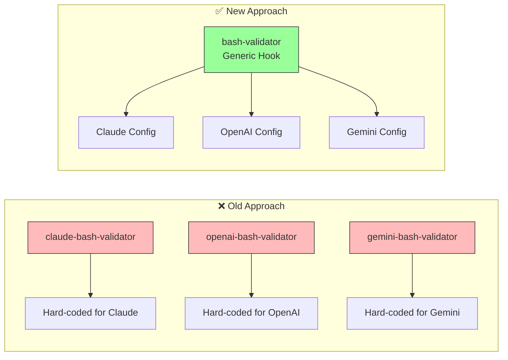
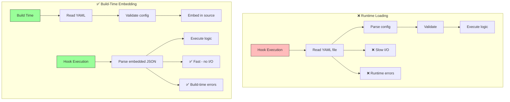
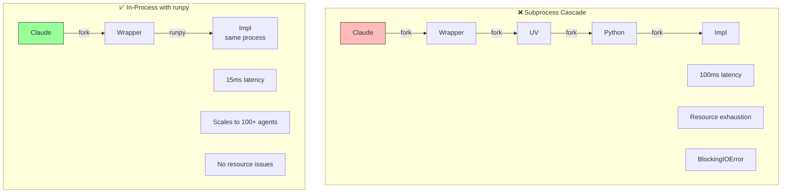
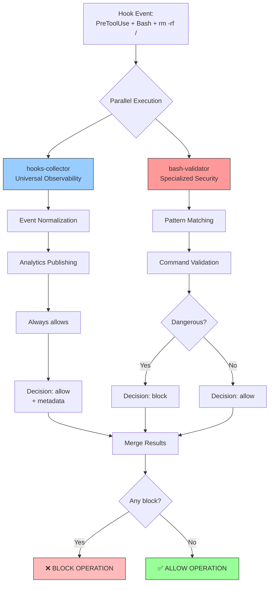
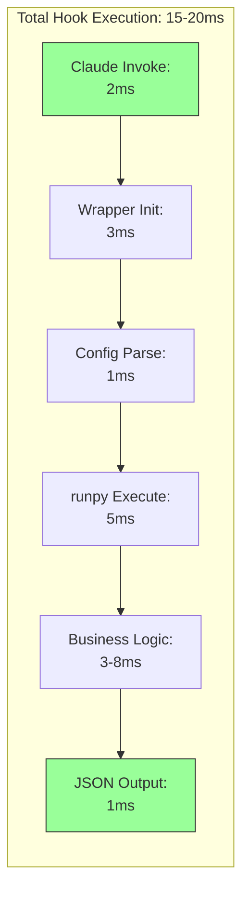

# Hooks System Architecture Overview

A visual guide to understanding the agentic-primitives hook system.

## High-Level Architecture



## Three-Phase System

### Phase 1: Development

**Location:** `primitives/v1/hooks/{category}/{hook-id}/`



**Key Principle:** Hooks are **generic** - they work with any agent provider.

```python
# primitives/v1/hooks/security/bash-validator/bash-validator.py
def validate_bash_command(command):
    """Generic validation logic - no agent-specific code"""
    if "rm -rf /" in command:
        return {"decision": "block"}
    return {"decision": "allow"}
```

### Phase 2: Configuration

**Location:** `providers/agents/{agent-id}/hooks-config/{hook-id}.yaml`



**Key Principle:** Agents **configure** generic hooks for their needs.

```yaml
# providers/agents/claude-code/hooks-config/bash-validator.yaml
agent: claude-code
hook_id: bash-validator

execution:
  timeout_sec: 5          # Claude wants fast response
  fail_on_error: true     # Block on validation failure
```

### Phase 3: Build

**Command:** `agentic-p build --provider claude`



**Output:**
```
build/claude/.claude/
├── settings.json                    # Hook registration
└── hooks/
    └── security/
        ├── bash-validator.py        # Wrapper (generated)
        └── bash-validator.impl.py   # Implementation (copied)
```

## Runtime Execution Flow



## Key Design Decisions

### 1. Generic Primitives, Agent Configuration



**Benefits:**
- ✅ Write once, use everywhere
- ✅ Easy to add new agents
- ✅ Centralized logic updates

### 2. Build-Time Config Embedding



### 3. In-Process Execution



## Hybrid Architecture

The system supports both **universal** and **specialized** hooks running in parallel:



## File Organization

```mermaid
graph TB
    subgraph "Source Code"
        P[primitives/v1/hooks/<br/>✓ Generic implementations<br/>✓ Version controlled<br/>✓ Testable]
        
        C[providers/agents/<br/>✓ Agent-specific configs<br/>✓ Timeouts, middleware<br/>✓ Execution preferences]
    end
    
    subgraph "Build System"
        B[agentic-p build]
    end
    
    subgraph "Build Output"
        W[{hook}.py Wrappers<br/>✓ Generated from template<br/>✓ Embedded config<br/>✓ Injection logic]
        
        I[{hook}.impl.py Impls<br/>✓ Copied from primitives<br/>✓ Pure business logic<br/>✓ No agent-specific code]
    end
    
    P --> B
    C --> B
    B --> W
    B --> I
    
    style P fill:#9f9,stroke:#333
    style C fill:#99f,stroke:#333
    style B fill:#f99,stroke:#333
    style W fill:#ff9,stroke:#333
    style I fill:#ff9,stroke:#333
```

## Performance Characteristics

### Latency Breakdown



### Scalability

| Metric | Old System | New System |
|--------|------------|------------|
| **Subprocess spawns per hook** | 3-5 | 0 (in-process) |
| **Latency (avg)** | 100ms | 15ms |
| **Max concurrent agents** | ~20 | 100+ |
| **Resource exhaustion** | Yes (BlockingIOError) | No |
| **Config load time** | 20ms (YAML I/O) | <1ms (embedded) |

## Development Workflow

```mermaid
flowchart TD
    Start[New Hook Idea] --> Create[Create primitive<br/>in primitives/v1/hooks/]
    
    Create --> WriteYAML[Write {hook}.hook.yaml<br/>Define metadata, events]
    WriteYAML --> WriteImpl[Write {hook}.py<br/>Implement logic]
    WriteImpl --> Test[Write tests<br/>tests/unit/claude/hooks/]
    
    Test --> Config[Create agent config<br/>providers/agents/claude-code/]
    Config --> Build[cargo run -- build --provider claude]
    
    Build --> Verify{Tests pass?}
    Verify -->|No| Debug[Debug]
    Debug --> WriteImpl
    
    Verify -->|Yes| Install[Install to project<br/>cp build/claude/.claude ~/project/]
    Install --> Manual[Manual testing in Claude]
    
    Manual --> Works{Works?}
    Works -->|No| Debug
    Works -->|Yes| Commit[Commit changes]
    
    style Start fill:#9f9,stroke:#333
    style Test fill:#99f,stroke:#333
    style Verify fill:#ff9,stroke:#333
    style Commit fill:#9f9,stroke:#333
```

## Related Documentation

- **Deep Dives:**
  - [ADR-014: Wrapper+Impl Pattern](../adrs/014-wrapper-impl-pattern.md)
  - [ADR-013: Hybrid Hook Architecture](../adrs/013-hybrid-hook-architecture.md)

- **Reference:**
  - [Build Output Structure](../_reference/build-output-structure.md)
  - [Hook Development Guide](../_reference/hook-development.md)

- **Examples:**
  - [USAGE_EXAMPLES.md](../../USAGE_EXAMPLES.md)
  - [INSTALLATION.md](../../INSTALLATION.md)

