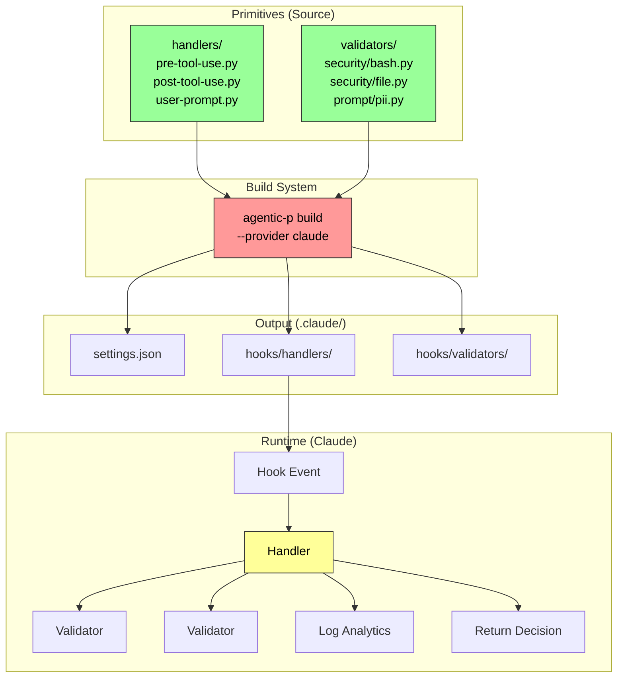
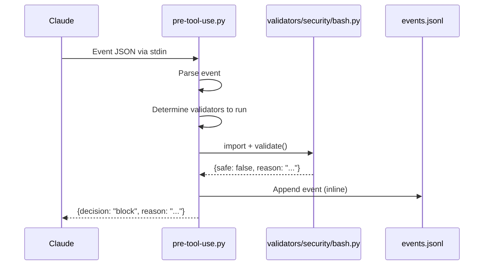
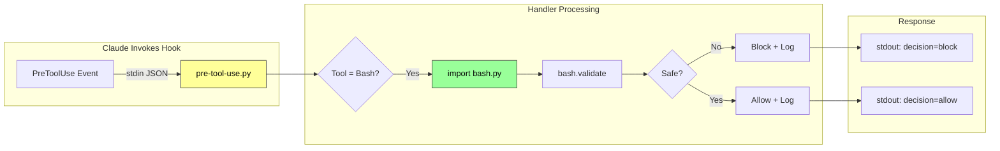

# Hooks System Architecture Overview

A visual guide to understanding the agentic-primitives hook system.

## High-Level Architecture



## Atomic Architecture

The hook system follows an **Atomic Architecture** with two types of components:

### Handlers (Entry Points)

Three handlers serve as entry points for Claude's hook events:

| Handler | Event | Purpose |
|---------|-------|---------|
| `pre-tool-use.py` | PreToolUse | Validate tools before execution |
| `post-tool-use.py` | PostToolUse | Log tool execution results |
| `user-prompt.py` | UserPromptSubmit | Validate user prompts |

### Validators (Pure Functions)

Validators are atomic, single-purpose validation functions:

| Validator | Purpose |
|-----------|---------|
| `security/bash.py` | Check shell commands for dangerous patterns |
| `security/file.py` | Check file operations for security issues |
| `prompt/pii.py` | Detect PII in user prompts |

## Data Flow



## File Structure

```
primitives/v1/hooks/
├── handlers/                    # Entry points (3 files)
│   ├── pre-tool-use.py         # Routes PreToolUse events
│   ├── post-tool-use.py        # Logs PostToolUse events
│   └── user-prompt.py          # Validates user prompts
│
└── validators/                  # Pure functions
    ├── security/
    │   ├── bash.py             # Shell command validation
    │   └── file.py             # File operation validation
    └── prompt/
        └── pii.py              # PII detection
```

## Key Design Principles

### 1. No External Dependencies

Hooks use **Python stdlib only**. No package imports that could fail.

```python
# ✅ Good - stdlib only
import json
import os
import sys
from pathlib import Path

# ❌ Bad - external package (removed)
from agentic_analytics import AnalyticsClient
```

### 2. Inline Analytics

Analytics logging is 6 lines of inline code, not a package import:

```python
def log_analytics(event: dict) -> None:
    try:
        path = Path(os.getenv("ANALYTICS_PATH", ".agentic/analytics/events.jsonl"))
        path.parent.mkdir(parents=True, exist_ok=True)
        with path.open("a") as f:
            f.write(json.dumps({"timestamp": datetime.now(UTC).isoformat(), **event}) + "\n")
    except Exception:
        pass  # Never block on analytics failure
```

### 3. Validators Are Pure

Validators have no side effects - they receive input and return output:

```python
def validate(tool_input: dict, context: dict | None = None) -> dict:
    """
    Returns:
        {"safe": bool, "reason": str | None, "metadata": dict | None}
    """
```

### 4. Handlers Compose Validators

Handlers dynamically import and call validators based on tool type:

```python
TOOL_VALIDATORS = {
    "Bash": ["security.bash"],
    "Write": ["security.file"],
    "Edit": ["security.file"],
}

def run_validators(tool_name: str, tool_input: dict, context: dict) -> dict:
    validators_dir = Path(__file__).parent.parent / "validators"
    for validator_name in TOOL_VALIDATORS.get(tool_name, []):
        # Dynamic import
        module = load_validator(validator_name, validators_dir)
        result = module.validate(tool_input, context)
        if not result.get("safe", True):
            return result
    return {"safe": True}
```

## Runtime Execution



## Settings.json Configuration

```json
{
  "hooks": {
    "PreToolUse": [{
      "matcher": "*",
      "hooks": [{
        "type": "command",
        "command": "${CLAUDE_PROJECT_DIR}/.claude/hooks/handlers/pre-tool-use.py",
        "timeout": 10
      }]
    }],
    "PostToolUse": [{
      "matcher": "*",
      "hooks": [{
        "type": "command",
        "command": "${CLAUDE_PROJECT_DIR}/.claude/hooks/handlers/post-tool-use.py",
        "timeout": 10
      }]
    }],
    "UserPromptSubmit": [{
      "hooks": [{
        "type": "command",
        "command": "${CLAUDE_PROJECT_DIR}/.claude/hooks/handlers/user-prompt.py",
        "timeout": 5
      }]
    }]
  }
}
```

## Performance

| Metric | Value |
|--------|-------|
| Handler execution | ~15ms |
| Validator call | ~5ms |
| Analytics log | ~1ms |
| No subprocess spawns | In-process imports |

## Adding New Validators

1. Create validator in `primitives/v1/hooks/validators/{category}/{name}.py`
2. Implement `validate(tool_input, context) -> dict`
3. Add to `TOOL_VALIDATORS` map in relevant handler
4. Rebuild and test

## Audit Trail & Correlation

Every hook decision event includes correlation and audit fields:

```json
{
  "timestamp": "2025-11-27T12:00:00Z",
  "event_type": "hook_decision",
  "handler": "pre-tool-use",
  "tool_name": "Bash",
  "decision": "block",
  "reason": "Dangerous command blocked",
  "session_id": "abc123",
  "tool_use_id": "toolu_01ABC123",
  "validators_run": ["security.bash"],
  "audit": {
    "transcript_path": "~/.claude/projects/.../session.jsonl",
    "cwd": "/Users/project",
    "permission_mode": "default"
  }
}
```

### Key Fields

| Field | Purpose |
|-------|---------|
| `tool_use_id` | Correlation key - links to agent `tool_call` events |
| `audit.transcript_path` | **Direct link to Claude Code conversation log** |
| `audit.cwd` | Working directory context |
| `audit.permission_mode` | Security context (`default`, `plan`, `bypassPermissions`) |

### Reading the Transcript

The `transcript_path` points to Claude Code's conversation JSONL. You can read it to see:
- What prompt triggered the tool call
- Previous context in the conversation
- Complete audit trail

```bash
# View conversation that triggered a hook decision
cat ~/.claude/projects/.../session.jsonl | jq '.'
```

## Related Documentation

- [ADR-014: Atomic Hook Architecture](../adrs/014-wrapper-impl-pattern.md)
- [ADR-016: Hook Event Correlation](../adrs/016-hook-event-correlation.md)
