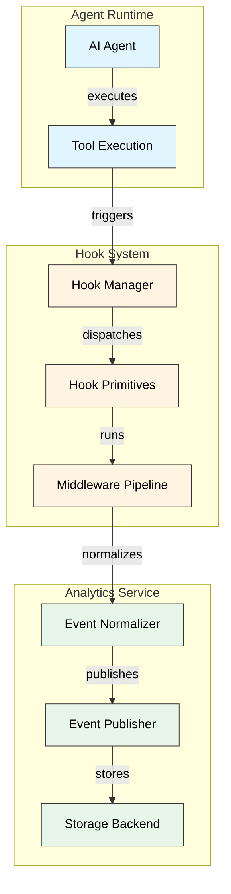
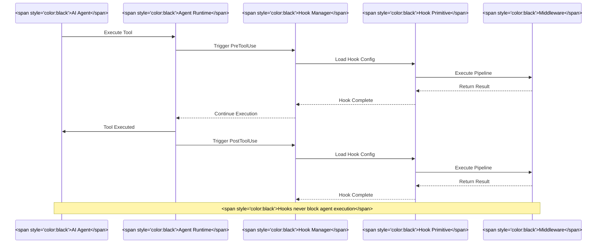
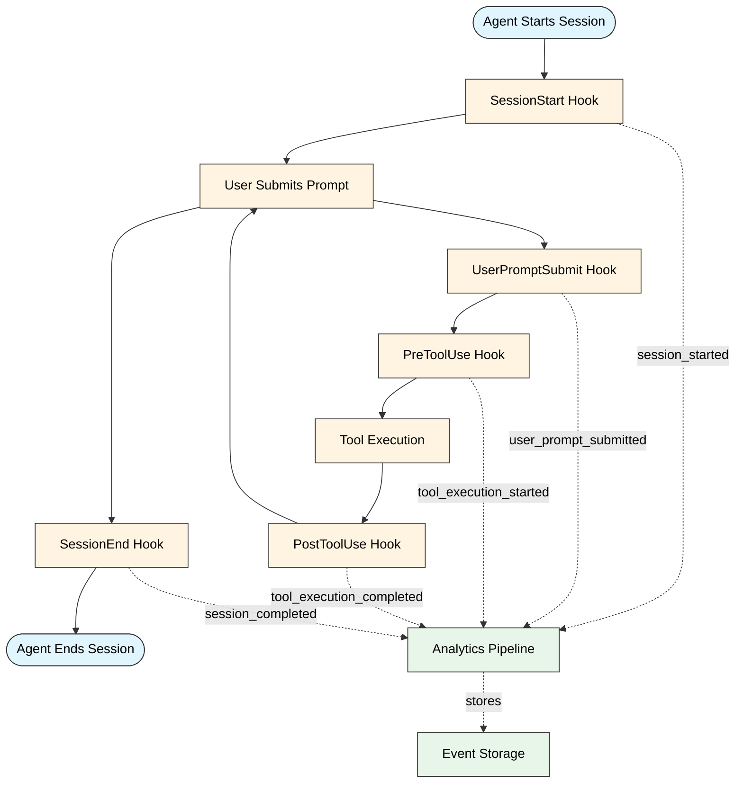
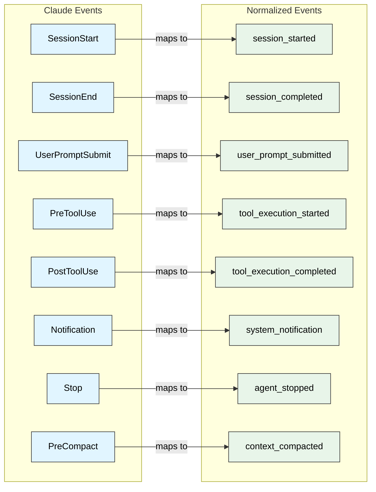
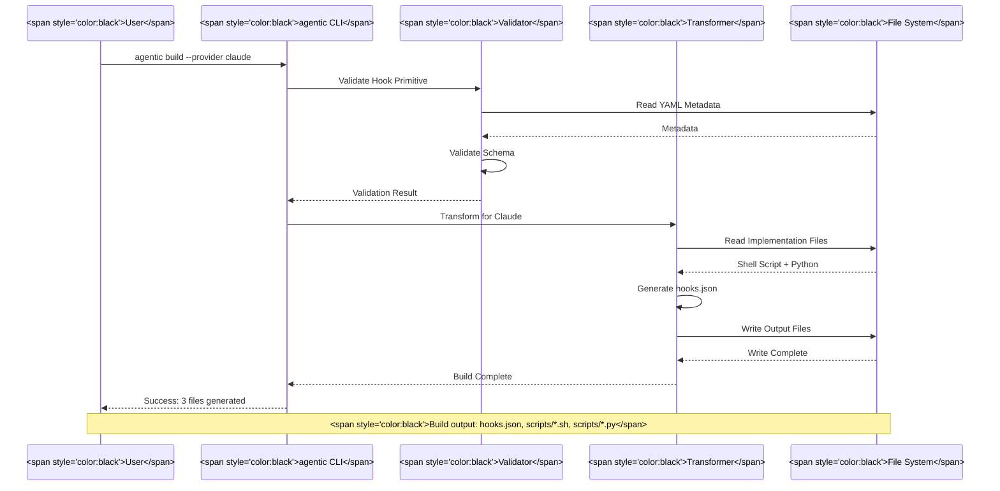
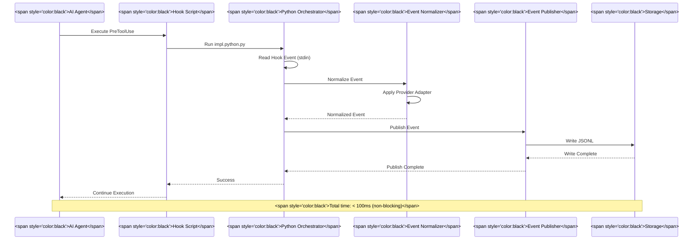
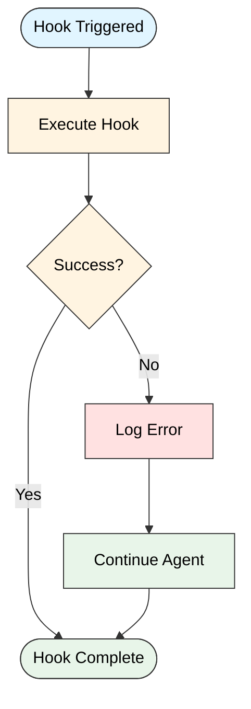

# Hooks System Architecture

This document provides comprehensive architecture diagrams for the Agentic Primitives hooks system, including the analytics middleware integration.

---

## Table of Contents

1. [System Overview](#system-overview)
2. [Hook Lifecycle](#hook-lifecycle)
3. [Analytics Pipeline](#analytics-pipeline)
4. [Provider Architecture](#provider-architecture)
5. [Data Flow](#data-flow)
6. [Component Interactions](#component-interactions)

---

## System Overview

### High-Level Architecture



---

## Hook Lifecycle

### Hook Event Flow



### Hook Primitive Structure

```mermaid
graph LR
    subgraph "Hook Primitive"
        Meta[<span style='color:black'>Metadata<br/>(YAML)</span>]
        Impl[<span style='color:black'>Implementation<br/>(Python/Shell)</span>]
        Config[<span style='color:black'>Configuration<br/>(Env Vars)</span>]
    end
    
    subgraph "Middleware Pipeline"
        M1[<span style='color:black'>Middleware 1</span>]
        M2[<span style='color:black'>Middleware 2</span>]
        M3[<span style='color:black'>Middleware N</span>]
    end
    
    Meta -->|<span style='color:black'>defines</span>| Impl
    Config -->|<span style='color:black'>configures</span>| Impl
    Impl -->|<span style='color:black'>orchestrates</span>| M1
    M1 -->|<span style='color:black'>pipes to</span>| M2
    M2 -->|<span style='color:black'>pipes to</span>| M3
    
    style Meta fill:#fff4e1,stroke:#333,color:#000
    style Impl fill:#fff4e1,stroke:#333,color:#000
    style Config fill:#fff4e1,stroke:#333,color:#000
    style M1 fill:#e8f5e9,stroke:#333,color:#000
    style M2 fill:#e8f5e9,stroke:#333,color:#000
    style M3 fill:#e8f5e9,stroke:#333,color:#000
```

---

## Analytics Pipeline

### Analytics Data Flow

```mermaid
graph TB
    subgraph "Input Layer"
        ClaudeHook[<span style='color:black'>Claude Hook Event</span>]
        OpenAIHook[<span style='color:black'>OpenAI Hook Event</span>]
        CustomHook[<span style='color:black'>Custom Hook Event</span>]
    end
    
    subgraph "Normalization Layer"
        HookInput[<span style='color:black'>HookInput Model</span>]
        Normalizer[<span style='color:black'>Event Normalizer</span>]
        
        subgraph "Adapters"
            ClaudeAdapter[<span style='color:black'>Claude Adapter</span>]
            OpenAIAdapter[<span style='color:black'>OpenAI Adapter</span>]
            CustomAdapter[<span style='color:black'>Custom Adapter</span>]
        end
    end
    
    subgraph "Output Layer"
        NormalizedEvent[<span style='color:black'>Normalized Event</span>]
        Publisher[<span style='color:black'>Event Publisher</span>]
        
        subgraph "Backends"
            FileBackend[<span style='color:black'>File Backend<br/>(JSONL)</span>]
            APIBackend[<span style='color:black'>API Backend<br/>(HTTP POST)</span>]
        end
    end
    
    ClaudeHook -->|<span style='color:black'>wraps</span>| HookInput
    OpenAIHook -->|<span style='color:black'>wraps</span>| HookInput
    CustomHook -->|<span style='color:black'>wraps</span>| HookInput
    
    HookInput -->|<span style='color:black'>routes to</span>| Normalizer
    
    Normalizer -->|<span style='color:black'>uses</span>| ClaudeAdapter
    Normalizer -->|<span style='color:black'>uses</span>| OpenAIAdapter
    Normalizer -->|<span style='color:black'>uses</span>| CustomAdapter
    
    ClaudeAdapter -->|<span style='color:black'>produces</span>| NormalizedEvent
    OpenAIAdapter -->|<span style='color:black'>produces</span>| NormalizedEvent
    CustomAdapter -->|<span style='color:black'>produces</span>| NormalizedEvent
    
    NormalizedEvent -->|<span style='color:black'>sends to</span>| Publisher
    
    Publisher -->|<span style='color:black'>writes to</span>| FileBackend
    Publisher -->|<span style='color:black'>posts to</span>| APIBackend
    
    style ClaudeHook fill:#e1f5ff,stroke:#333,color:#000
    style OpenAIHook fill:#e1f5ff,stroke:#333,color:#000
    style CustomHook fill:#e1f5ff,stroke:#333,color:#000
    style HookInput fill:#fff4e1,stroke:#333,color:#000
    style Normalizer fill:#fff4e1,stroke:#333,color:#000
    style ClaudeAdapter fill:#fff4e1,stroke:#333,color:#000
    style OpenAIAdapter fill:#fff4e1,stroke:#333,color:#000
    style CustomAdapter fill:#fff4e1,stroke:#333,color:#000
    style NormalizedEvent fill:#e8f5e9,stroke:#333,color:#000
    style Publisher fill:#e8f5e9,stroke:#333,color:#000
    style FileBackend fill:#e8f5e9,stroke:#333,color:#000
    style APIBackend fill:#e8f5e9,stroke:#333,color:#000
```

### Analytics Event Transformation

```mermaid
graph LR
    subgraph "Provider-Specific Event"
        PSE[<span style='color:black'>PreToolUse<br/>tool_name: Write<br/>tool_input: {...}<br/>session_id: abc123<br/>permission_mode: default</span>]
    end
    
    subgraph "Normalized Event"
        NE[<span style='color:black'>tool_execution_started<br/>provider: claude<br/>session_id: abc123<br/>timestamp: 2025-11-19T12:00:00Z<br/>context: ToolExecutionContext<br/>metadata: EventMetadata</span>]
    end
    
    subgraph "Storage Format"
        SF[<span style='color:black'>JSONL Line:<br/>{event_type, timestamp,<br/>session_id, provider,<br/>context, metadata}</span>]
    end
    
    PSE -->|<span style='color:black'>Adapter</span>| NE
    NE -->|<span style='color:black'>Publisher</span>| SF
    
    style PSE fill:#e1f5ff,stroke:#333,color:#000
    style NE fill:#fff4e1,stroke:#333,color:#000
    style SF fill:#e8f5e9,stroke:#333,color:#000
```

---

## Provider Architecture

### Provider Transformer Flow

```mermaid
graph TB
    subgraph "Source"
        Primitives[<span style='color:black'>Hook Primitives<br/>(primitives/v1/hooks/)</span>]
    end
    
    subgraph "CLI Build System"
        BuildCmd[<span style='color:black'>agentic build</span>]
        Transformer[<span style='color:black'>Provider Transformer</span>]
        
        subgraph "Transformers"
            ClaudeT[<span style='color:black'>Claude Transformer</span>]
            OpenAIT[<span style='color:black'>OpenAI Transformer</span>]
            CursorT[<span style='color:black'>Cursor Transformer</span>]
        end
    end
    
    subgraph "Output"
        ClaudeOut[<span style='color:black'>.claude/hooks/<br/>hooks.json<br/>scripts/*.sh</span>]
        OpenAIOut[<span style='color:black'>.openai/hooks/<br/>config.yaml</span>]
        CursorOut[<span style='color:black'>.cursor/hooks/<br/>hooks.json</span>]
    end
    
    Primitives -->|<span style='color:black'>reads</span>| BuildCmd
    BuildCmd -->|<span style='color:black'>selects</span>| Transformer
    
    Transformer -->|<span style='color:black'>claude</span>| ClaudeT
    Transformer -->|<span style='color:black'>openai</span>| OpenAIT
    Transformer -->|<span style='color:black'>cursor</span>| CursorT
    
    ClaudeT -->|<span style='color:black'>generates</span>| ClaudeOut
    OpenAIT -->|<span style='color:black'>generates</span>| OpenAIOut
    CursorT -->|<span style='color:black'>generates</span>| CursorOut
    
    style Primitives fill:#e1f5ff,stroke:#333,color:#000
    style BuildCmd fill:#fff4e1,stroke:#333,color:#000
    style Transformer fill:#fff4e1,stroke:#333,color:#000
    style ClaudeT fill:#fff4e1,stroke:#333,color:#000
    style OpenAIT fill:#fff4e1,stroke:#333,color:#000
    style CursorT fill:#fff4e1,stroke:#333,color:#000
    style ClaudeOut fill:#e8f5e9,stroke:#333,color:#000
    style OpenAIOut fill:#e8f5e9,stroke:#333,color:#000
    style CursorOut fill:#e8f5e9,stroke:#333,color:#000
```

### Provider-Agnostic Design

```mermaid
graph TB
    subgraph "Provider Layer"
        Claude[<span style='color:black'>Claude Desktop</span>]
        OpenAI[<span style='color:black'>OpenAI Codex</span>]
        Cursor[<span style='color:black'>Cursor IDE</span>]
        Gemini[<span style='color:black'>Gemini Code</span>]
    end
    
    subgraph "Abstraction Layer"
        HookPrimitive[<span style='color:black'>Hook Primitive<br/>(Provider-Agnostic)</span>]
        StandardEvents[<span style='color:black'>Standard Event Schema</span>]
    end
    
    subgraph "Analytics Layer"
        Analytics[<span style='color:black'>Analytics Service<br/>(Provider-Agnostic)</span>]
        Storage[<span style='color:black'>Unified Storage</span>]
    end
    
    Claude -->|<span style='color:black'>provider: claude</span>| HookPrimitive
    OpenAI -->|<span style='color:black'>provider: openai</span>| HookPrimitive
    Cursor -->|<span style='color:black'>provider: cursor</span>| HookPrimitive
    Gemini -->|<span style='color:black'>provider: gemini</span>| HookPrimitive
    
    HookPrimitive -->|<span style='color:black'>normalizes to</span>| StandardEvents
    StandardEvents -->|<span style='color:black'>processes</span>| Analytics
    Analytics -->|<span style='color:black'>stores</span>| Storage
    
    style Claude fill:#e1f5ff,stroke:#333,color:#000
    style OpenAI fill:#e1f5ff,stroke:#333,color:#000
    style Cursor fill:#e1f5ff,stroke:#333,color:#000
    style Gemini fill:#e1f5ff,stroke:#333,color:#000
    style HookPrimitive fill:#fff4e1,stroke:#333,color:#000
    style StandardEvents fill:#fff4e1,stroke:#333,color:#000
    style Analytics fill:#e8f5e9,stroke:#333,color:#000
    style Storage fill:#e8f5e9,stroke:#333,color:#000
```

---

## Data Flow

### Complete System Data Flow



### Event Type Mapping



---

## Component Interactions

### CLI Build Process



### Analytics Collector Execution



### Error Handling Flow



---

## Deployment Architecture

### Production Deployment

```mermaid
graph TB
    subgraph "Agent Environment"
        Agent[<span style='color:black'>AI Agent</span>]
        Hooks[<span style='color:black'>Installed Hooks</span>]
    end
    
    subgraph "Analytics Service"
        Normalizer[<span style='color:black'>Event Normalizer</span>]
        Publisher[<span style='color:black'>Event Publisher</span>]
    end
    
    subgraph "Storage Layer"
        LocalFS[<span style='color:black'>Local File System<br/>(JSONL)</span>]
        S3[<span style='color:black'>S3 Bucket<br/>(via API)</span>]
        Database[<span style='color:black'>Database<br/>(via API)</span>]
        Analytics[<span style='color:black'>Analytics Platform<br/>(via API)</span>]
    end
    
    Agent -->|<span style='color:black'>triggers</span>| Hooks
    Hooks -->|<span style='color:black'>executes</span>| Normalizer
    Normalizer -->|<span style='color:black'>publishes</span>| Publisher
    
    Publisher -->|<span style='color:black'>file backend</span>| LocalFS
    Publisher -->|<span style='color:black'>api backend</span>| S3
    Publisher -->|<span style='color:black'>api backend</span>| Database
    Publisher -->|<span style='color:black'>api backend</span>| Analytics
    
    style Agent fill:#e1f5ff,stroke:#333,color:#000
    style Hooks fill:#e1f5ff,stroke:#333,color:#000
    style Normalizer fill:#fff4e1,stroke:#333,color:#000
    style Publisher fill:#fff4e1,stroke:#333,color:#000
    style LocalFS fill:#e8f5e9,stroke:#333,color:#000
    style S3 fill:#e8f5e9,stroke:#333,color:#000
    style Database fill:#e8f5e9,stroke:#333,color:#000
    style Analytics fill:#e8f5e9,stroke:#333,color:#000
```

---

## Legend

### Color Coding

- **Light Blue** (`#e1f5ff`): Agent/Provider Layer
- **Light Yellow** (`#fff4e1`): Hook System/Processing Layer
- **Light Green** (`#e8f5e9`): Analytics/Storage Layer
- **Light Red** (`#ffe1e1`): Error Handling

### Relationship Types

- **Solid Lines**: Direct execution flow
- **Dashed Lines**: Asynchronous/non-blocking flow
- **Arrows**: Data flow direction

---

## Additional Resources

- [Analytics Service Architecture](../../services/analytics/ARCHITECTURE.md)
- [Hook Primitives Specification](../../specs/v1/hook-meta.schema.json)
- [Analytics Events Schema](../../specs/v1/analytics-events.schema.json)
- [Security Audit](../../services/analytics/SECURITY.md)

