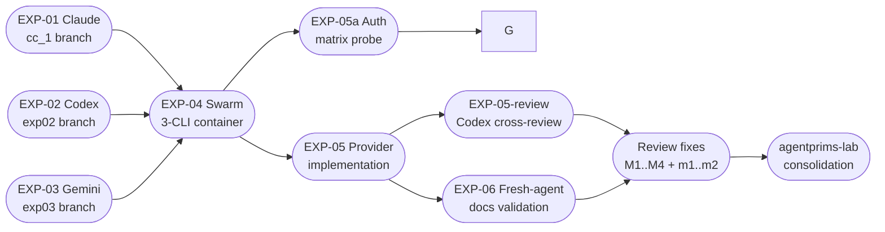
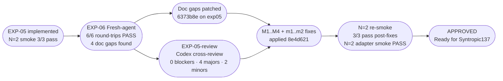

# Interactive-tmux Workspaces

### Driving Claude / Codex / Gemini in containers — no `-p` required

<br>

| | |
|---|---|
| **Lab** | AgentParadise/agentic-primitives `agentprims-lab` |
| **Date** | 2026-06-10  00:54Z – 05:50Z  (~296 min) |
| **Agents** | cc_1 (Claude) · cod_1 (Codex) · gmi_1 (Gemini) · fresh-agent |
| **Outcome** | 9 experiments · 9 × `go` · 1 production provider shipped |

<br>

> Source: `experiments/ANALYTICS.md` + `experiments/analytics-data.json`

---
layout: default
---

# Mission + Why Now

## The economic trigger

`claude -p` (programmatic / one-shot mode) is **leaving the Max plan in ~5 days** from lab open.

Continuing `-p` = **API-billed** at full token cost. The Max-plan subsidy that makes the agentic-coding flywheel viable disappears.

## The escape hatch hypothesis

> Drive the **interactive** CLIs (`claude`, `codex`, `gemini`) inside workspace containers via a **tmux session**, with the host poking input and reading output through  
> `docker exec <c> tmux send-keys` / `tmux capture-pane`

- Same agents · same workspaces · same observability
- **Different transport** — subscription plan instead of API plan
- End state: a **new workspace provider** (`interactive-tmux`) that exposes the same lifecycle contract as today's `claude-cli` provider

## What's out of scope
Transport reliability only — not answer quality, not perf vs `-p`, not multi-host.

---
layout: default
---

# Method: Running-Experiments Protocol

Three structural guarantees across every experiment:

| Rule | Detail |
|---|---|
| **Hypothesis-first commit** | Experiment file committed (frozen) before any probe runs. Results in second commit only. |
| **Evidence count in every claim** | All empirical claims annotated `(observed in N runs)`. Single-observation claims flagged explicitly. |
| **Throwaway credentials only** | `cp -R ~/.claude /tmp/claude-<slug>` then bind-mount. Never baked into image, never committed. |

## Lab pipeline



Parallel lanes via git worktrees. One agent per branch, no shared state, all merged to `agentprims-lab`.

---
layout: default
---

# Experiment Scoreboard

| ID | Title | Verdict | Owner | Hyp→Results | Report |
|---|---|---|---|---|---|
| EXP-01 | claude interactive in tmux | **go** | cc_1 | 21 min | 15,234 B |
| EXP-02 | codex interactive in tmux | **go** | cod_1 | ~15 min | 4,836 B |
| EXP-03 | gemini interactive in tmux | **go** | gmi_1 | 15 min | 3,994 B |
| EXP-04 | combined swarm-in-a-container | **go** | gmi_1 | 11 min | 7,675 B |
| EXP-04b | swarm hardening + run count | **go** | gmi_1 | 5 min | _(section)_ |
| EXP-05a | claude auth 2×2 matrix | **go** (both files req'd) | cod_1 | 48 min | 3,910 B |
| EXP-05 | `interactive-tmux` provider | **go** | cc_1 | 33 min (+118 incl. fixes) | 29,082 B |
| EXP-05-review | codex cross-review | **go** (0 blockers) | cod_1 | ~50 min | 6,929 B |
| EXP-06 | fresh-agent validation | **go** (6/6 pass) | fresh-agent | 15 min | 11,358 B |

<br>

**9/9 `go` verdicts.** Total report corpus: 104,781 bytes across 13 markdown files.

---
layout: default
---

# Key Metrics: Durations + Run Counts

## Lab timeline (UTC, 2026-06-10)

```
01:00Z ─ EXP-03 hyp ──[15 min]──── results
01:06Z ─ EXP-01 hyp ──────[21 min]────────── results
01:00Z ─ EXP-02 est ──[~15 min]── results
01:24Z ─ EXP-04 hyp ─[11 min]── results
01:41Z ─ EXP-04b hyp [5 min] results
01:42Z ─ EXP-05a hyp ─────────────────[48 min]──────────── results
01:47Z ─ EXP-05 hyp ──────[33 min]──── results ─[+35]─ docs ─[+50]─ fixes
02:27Z ─ EXP-06 hyp ─[15 min]── results
02:20Z ─ EXP-05-review starts ──────[~50 min]──────── commit
```

## Run counts claimed

| Experiment | Runs | Unit |
|---|---|---|
| EXP-01 | 3 runs × 5 legs = **15 legs** | All 5 falsifying modes ruled out |
| EXP-02 | 1 full run, **2 completions** | "1 run" noted explicitly |
| EXP-03 | 1 run | "observed in 1 run" |
| EXP-04b | **3 runs** | Swarm hardening replicate |
| EXP-05a | N=2 × 4 cells = **8 container runs** | Full 2×2 auth matrix |
| EXP-05 | **N=2 smoke runs** (pre-review) + N=2 (post-fixes) | 3 agents each |
| EXP-06 | **6 round-trips** (3 agents × 2 paths) | smoke + Python driver |

---
layout: default
---

# Key Metrics: Friction Items

20 friction items across all three FRICTION files:

| Category | Claude | Codex | Gemini | **Total** |
|---|---|---|---|---|
| `config` | 3 | 1 | 3 | **7** |
| `workaround-found` | 4 | 1 | 0 | **5** |
| `tooling-bug` | 1 | 2 | 1 | **4** |
| `docs-gap` | 1 | 1 | 2 | **4** |
| **Total** | **9** | **5** | **6** | **20** |

**All 20 have documented workarounds. Zero blocked a `go` verdict.**

<br>

**Notable per-agent profile:**
- **Claude** heaviest (9 items) — reflects the deepest single-agent investigation (3 runs × 5 legs)
- **Gemini** items G-4/G-5/G-6 are cross-agent (found during swarm EXP-04, not EXP-03)
- `config` dominates (35%) — all solvable at provider init time; the provider encodes all of them

---
layout: default
---

# Key Metrics: Budget Burn

Percentage-remaining start → end for the lab session (2026-06-10):

| Provider | Plan | Start % | End % | Burned pts |
|---|---|---|---:|---:|
| gemini | pro | 100 | 7 | **93** |
| codex-spark | weekly | 61 | 36 | **25** |
| claude | weekly | 93 | 78 | **15** |
| codex | weekly | 63 | 57 | **6** |
| gemini | flash | 100 | 96 | **4** |

<br>

**Gemini-pro burned 93 pts** — gmi_1 ran two full experiment pairs (EXP-03 + EXP-04/04b).

**Codex-spark burned 25 pts** — cod_1 ran EXP-02 + EXP-05a + EXP-05 cross-review in the spark lane.

**Claude weekly at -15 pts** — cc_1 owned EXP-01 (deepest single-agent probe) + EXP-05 (largest deliverable by report size and implementation depth).

Flash-lane gemini nearly untouched (4 pts) — used only for analytics/R1 post-lab.

---
layout: default
---

# The Per-CLI Driving Matrix
## Crown-jewel technical artifact — encoded in `driver/interactive_tmux.py`

| Dimension | `claude` | `codex` | `gemini` |
|---|---|---|---|
| **Submit keys** | `send-keys -l TEXT` then `send-keys Enter` (two-step) | `TEXT` + `C-j` + `C-m` first msg; `Enter` after | `TEXT` + `Enter` — **never `C-m`** (unreliable via docker exec) |
| **Readiness signals** | 3-AND: no `"esc to interrupt"` · `❯\s*$` empty · `"? for shortcuts"` footer | `"• Working"` absent **AND** pane bytes stable across N polls | `"Type your message or @path/to/file"` prompt indicator |
| **Stability layer** | Multi-signal covers TUI redraws | Byte-stable check required — single absent-Working check false-passes ~1/3 | Single signal sufficient |
| **Init gates** | Pre-seed `~/.claude.json` (onboarding-skip + workspace trust + `installMethod: npm-global`); tmux size `-x 200 -y 50` | `--no-alt-screen`; send `1`+Enter (trust banner); send `Escape` (hooks) | Patch `~/.gemini/settings.json`: `security.folderTrust.enabled: false` |
| **Auth mount** | `~/.claude/` dir + `~/.claude.json` file — **both required** | `~/.codex/` dir (skip `tmp/` `log/` on copy) | `~/.gemini/` dir |
| **First-prompt quirk** | None after init gates | C-j C-m required — single C-m places text, does not dispatch | None after settings patch |
| **Node requirement** | any | any | **node:22** — node:18 crashes (`undici File` error) |

<br>

> Every row encodes a real friction item. The driver is what operators never have to re-derive.

---
layout: default
---

# Auth Findings: EXP-05a — Claude 2×2 Mount Matrix

**Contradiction entering EXP-05:** EXP-01 said tokens are in `~/.claude/.credentials.json`; EXP-04 said tokens are in `~/.claude.json`. Both were partially right.

## Empirical result (N=2 per cell, 8 container runs total)

| Mount | Startup outcome | Auth outcome | Verdict |
|---|---|---|---|
| **none** | Theme/login wizard | Needs interactive login | ❌ |
| **`~/.claude/` only** | `config file not found at ~/.claude.json` → login UI | Needs interactive login | ❌ |
| **`~/.claude.json` only** | Normal splash + trust prompt | Session starts, **not authenticated** (`Not logged in · /login`) — API billing, Sonnet 4.6 | ❌ |
| **both** | Normal splash + trust prompt | **Authenticated, Max plan** (Opus 4.7 · Claude Max) | ✅ |

## Resolution

| File | Contains | Role |
|---|---|---|
| `~/.claude/.credentials.json` | `claudeAiOauth.{accessToken, refreshToken, ...}` | **OAuth tokens** — required for Max plan |
| `~/.claude.json` | `oauthAccount` metadata, onboarding flags, project trust map | **Metadata** — required for wizard-skip and "Welcome back" |

Provider driver mounts both. Synthesises `~/.claude.json` when host lacks one (carries onboarding-skip + workspace trust; never synthesises tokens).

---
layout: default
---

# Swarm-in-a-Container: EXP-04 / EXP-04b

**One Docker image. Three CLIs. Three tmux windows. Zero cross-talk.**

## Setup
- Base: `node:22` image with `@anthropic-ai/claude-code@2.1.126` + `@openai/codex@0.139.0` + `@google/gemini-cli@latest`
- Mount credentials for all three agents from throwaway host copies
- tmux session `swarm` with windows `claude-win` / `codex-win` / `gemini-win`

## Results (EXP-04: 1 run; EXP-04b: 3 runs — hardening)

| Test | Result |
|---|---|
| Independent prompts (10+10, 20+20, 30+30) | All correct: `● 20`, `• 40`, `✦ 60` |
| Concurrent prompt (Claude + Gemini simultaneously, background `&`) | ✅ No cross-talk; independent contexts preserved |
| `docker stop` + `docker start` + replay | ✅ All three re-authenticate; accept new prompts |
| Swarm reproduced N=3 independent runs (EXP-04b) | ✅ 3/3 |

## Footprint (EXP-04b measurements)

| Metric | Value |
|---|---|
| Docker image size | **3.03 GB** |
| Claude idle RSS | ~300 MB |
| Codex idle RSS | ~173 MB (rust binary + node wrapper) |
| Gemini idle RSS | ~433 MB (two Node processes) |
| **Total idle RSS** | **~906 MB** |

---
layout: default
---

# Provider Deliverable: `interactive-tmux`

Location: `providers/workspaces/interactive-tmux/`

## File inventory

| File | Lines | Role |
|---|---|---|
| `Dockerfile` | 114 | `node:22-slim` + 3 CLIs + tmux; non-root `agent:agent` (uid 1000) |
| `manifest.yaml` | 130 | Provider config, image tag, runtime mode |
| `README.md` | 274 | Build · smoke · Python API · per-agent matrix · auth explainer |
| `driver/interactive_tmux.py` | 1,064 | Driver: 5 public methods + 3 adapter classes + CLI shim + WorkspaceProvider adapter |
| `scripts/smoke.sh` | 82 | 3-agent smoke (marker+token grep) |
| `scripts/smoke_provider_adapter.py` | 201 | WorkspaceProvider 6-method smoke + Claude prompt round-trip |
| `scripts/entrypoint.sh` | 41 | Container init (no settings.json clobber — EXP-01 F-2 fix) |
| **Total** | **1,915** | |

Build: **544 MB** image · **~5 min** on VPS · `claude-cli` provider untouched (verified: git diff empty)

## Public API (five primitives)

```python
ws = InteractiveTmuxWorkspace.start_workspace(name, host_auth, image, workdir, tmux_size)
ws.send_message(agent, text)          # agent ∈ {"claude","codex","gemini"}
result = ws.await_completion(agent, timeout)   # returns AwaitResult
response = ws.capture_response(agent)
ws.stop()
```

## Review fixes applied (M1..M4 from EXP-05-review, commit 8e4d621)

| Fix | Change |
|---|---|
| **M1** | `start_workspace(strict_startup=True)` raises `StartupReadinessError` on any pane failure |
| **M2** | `WorkspaceProvider` adapter (`create/destroy/execute/write_file/read_file/file_exists`) added |
| **M3** | `await_completion` returns `AwaitResult` (ready / timed_out / reason / duration_ms / error) |
| **M4** | Claude readiness: all 3 signals from EXP-01 F-5 now checked (was 2) |

---
layout: default
---

# Validation Chain



<br>

## CODE-AUDIT cross-checks (`experiments/CODE-AUDIT.md` — CODEX R1)

| Claim checked | Verdict |
|---|---|
| EXP-05 smoke: 3/3 agents pass per run (`runs/smoke-*.txt`) | ✅ **holds** |
| EXP-05a: 2×2 mount matrix covers all combos; only `both` passes | ✅ **holds** |
| EXP-05-review M1: `StartupReadinessError` raise path present in driver | ✅ **holds** |
| No functional blockers in deliverable files | ✅ confirmed |

Provider: 1,915 LOC across 8 tracked files + 10 run artifacts. `claude-cli` untouched.

## Fresh-agent score detail

| Agent | Smoke | Python driver | Tokens observed |
|---|---|---|---|
| claude | ✅ PASS | ✅ PASS | `● SMOKE-CLAUDE-2705074`, `● EXP06-PY-CLAUDE` |
| codex | ✅ PASS | ✅ PASS | `• SMOKE-CODEX-2705074`, `• EXP06-PY-CODEX` |
| gemini | ✅ PASS | ✅ PASS | `✦ SMOKE-GEMINI-2705074`, `✦ EXP06-PY-GEMINI` |

---
layout: default
---

# Top Insights (1–5)
## From `experiments/INSIGHTS.md` — evidence-first

**1 · TUI programmatic driving is feasible and robust**  
`docker exec tmux send-keys/capture-pane` reliably substitutes for a native API. Proven for three independent CLIs across 15+ legs.  
→ _Syntropic137: expand tool integration to any TUI-fronted service, not just AI CLIs._

**2 · Per-agent quirks demand abstraction, not workarounds in callers**  
Claude needs a 3-signal ready check; Codex needs C-j C-m and a byte-stability invariant; Gemini rejects C-m.  
Each per-agent difference is real and measured, not assumed.  
→ _Build adapter classes once; callers use one API forever._

**3 · Base image version is a hard constraint, not a preference**  
`ubuntu:24.04` ships Node 18, which crashes `gemini-cli` (`undici File` error). `node:22` required.  
→ _Pin exact base image versions; never use distro-default for CLI tools._

**4 · Swarm containers are viable at ~906 MB idle RSS + 3 GB image**  
All three agents coexist, maintain independent contexts, survive container restart, survive concurrent prompts.  
→ _Single-container swarm is the right unit of deployment for this workload._

**5 · Readiness detection needs multi-signal + stability, not polling**  
Claude: 3-AND signals. Codex: absent-Working AND byte-stable-across-N-polls. Single signal false-passes ~1/3 runs.  
→ _Every new CLI integration must empirically measure and encode its done-state, not assume a single indicator is sufficient._

---
layout: default
---

# Top Insights (6–10)
## From `experiments/INSIGHTS.md` — evidence-first

**6 · Credential surface area is two files, not one**  
Claude auth requires BOTH `~/.claude/.credentials.json` (tokens) AND `~/.claude.json` (metadata + onboarding markers).  
EXP-05a 2×2 matrix: only the `both` cell reaches Max plan. (8 container runs, 4 cells × N=2.)  
→ _Document the two-surface split in every workspace provider that touches Claude auth._

**7 · Startup validation must propagate, not swallow failures**  
Review finding M1: `start_workspace` was silently succeeding when agent panes never reached idle.  
Callers had no way to know. Fixed by `StartupReadinessError` in strict mode.  
→ _Any "start" operation that returns before verifying readiness is a latent race condition._

**8 · Structured result objects unlock orchestration intelligence**  
`AwaitResult` (M3 fix) exposes `ready / timed_out / reason / duration_ms / error`.  
Bare `bool` can't distinguish "never started" from "timed out" from "agent error."  
→ _Design result schemas upfront; retrofitting them means touching every call site._

**9 · Fresh-agent validation is the real acceptance test**  
EXP-06 found 4 doc gaps the lab authors never noticed because they held tribal knowledge.  
Gap G1 (Python import path) was low-severity but **blocked** step C for a cold reader.  
→ _Every provider/API should have a mandatory fresh-agent doc-validation experiment before shipping._

**10 · Docs are a first-class deliverable, not a post-ship artifact**  
4 gaps found, 4 patched, 0 architectural changes needed. Cost: minimal. Value: provider is now  
self-contained for Syntropic137 integration without a lab-knowledge handoff.  
→ _Allocate a fresh-agent validation experiment slot in every lab plan, not just this one._

---
layout: default
---

# Orchestration Lessons
## What the lab taught us about running multi-model labs

**Session wipe recovered entirely from git**  
Mid-lab tmux-session wipe lost only one in-flight review (not committed). Everything else was on a branch.  
→ _Commit early, commit often. The lab's "hypothesis-first commit" rule made session loss a non-event._

**ntm first-send sat unsubmitted 3×**  
The ntm send mechanism accepted keystrokes but held them unsubmitted. Symptom: context built silently.  
Recovery: clear + resend. No work lost, but invisible to the operator until inspected.  
→ _After dispatching any ntm send, verify receipt — don't assume delivered because no error was shown._

**Unrelated fork-bomb locked out SSH (28,683 processes)**  
An apss wrapper in a different project fork-bombed the VPS. Severity: high. Blast radius: total SSH lockout.  
Recovery: root console, reap processes, resume lab. Lab work unaffected because commits were pushed before lockout.  
→ _Commit and push frequently across all lab agents. A locked-out VPS is a recoverable event if the branch is upstream._

**Gemini committed to local `main`**  
gmi_1 committed to `main` instead of its experiment branch. Severity: medium (never pushed).  
Recovery: move commit to branch, `git reset --hard`, verify main clean.  
→ _Per-agent branch discipline is non-negotiable. Enforce `git config branch.main.pushRemote no` or equivalent._

**Branch hygiene enabled the whole lab**  
6 branches pushed, zero conflicts at consolidation. The `agentprims-lab` consolidation was a clean cherry-pick.  
→ _One agent, one branch, clear naming convention (`agentprims-exp0N`). Deviations cost disproportionate recovery time._

---
layout: default
---

# Open Items + Next Hypotheses

## Syntropic137 integration (immediate)

| Item | Status |
|---|---|
| Drop `interactive-tmux` provider into Syntropic137 isolation layer | Unblocked — `WorkspaceProvider` adapter shipped (M2 fix) |
| Wire `AwaitResult` into orchestration routing decisions | Unblocked — `AwaitResult` schema shipped (M3 fix) |
| Validate against Syntropic137's acceptance test suite | **Next experiment** |

## Streaming output (follow-up arc)

Current API: poll-then-capture (`capture_response` returns full pane dump after `await_completion`).  
Future: structured event stream — token-by-token updates for long-running prompts.  
Options: (a) plugin hooks against interactive claude TUI, (b) screen-scraping for known event shapes.  
→ _Probe as a standalone experiment; don't coerce v1 poll API into a streaming shape._

## Antigravity / `-p` migration path

`claude-cli` provider stays as-is for API-billed callers. The `interactive-tmux` provider is the Max-plan path.  
Operators with both credentials can select at `start_workspace` call time via `image=` parameter.  
→ _Document the dual-provider setup in the workspace README for operators managing both billing paths._

## Other follow-ups from EXP-05

- Large-prompt bracketed-paste behavior (>10 KB prompts — not yet tested, predicted threshold unknown)
- Reconnect to running workspace from a different driver process
- OTel / JSONL event capture from the interactive transport (no `--output-format stream-json` equivalent yet)
- Auth token expiry + headless re-auth automation

---
layout: default
---

# Closing Recipe
## How to use the provider in 5 lines

```bash
# 1. Build the image (uses existing convention — no script changes needed)
uv run scripts/build-provider.py interactive-tmux

# 2. Run the smoke test (verifies all 3 agents end-to-end)
bash providers/workspaces/interactive-tmux/scripts/smoke.sh
```

```python
# 3. Use from Python (run from repo root; set PYTHONPATH first)
# PYTHONPATH=providers/workspaces/interactive-tmux/driver
from interactive_tmux import InteractiveTmuxWorkspace
from pathlib import Path

ws = InteractiveTmuxWorkspace.start_workspace(
    name="my-workspace",
    host_auth={"claude": Path("~/.claude").expanduser(),
               "codex":  Path("~/.codex").expanduser(),
               "gemini": Path("~/.gemini").expanduser()},
)
ws.send_message("claude", "Reply only with: HELLO")
result = ws.await_completion("claude", timeout=60.0)
print(ws.capture_response("claude"))   # → "● HELLO"
ws.stop()
```

<br>

| Need | File |
|---|---|
| Build + smoke docs | `providers/workspaces/interactive-tmux/README.md` |
| Per-agent quirk reference | README §  "Per-agent behaviour matrix" |
| Lab evidence | `experiments/EXP-05-interactive-tmux-provider.md` |
| This deck's data | `experiments/ANALYTICS.md` + `analytics-data.json` |
